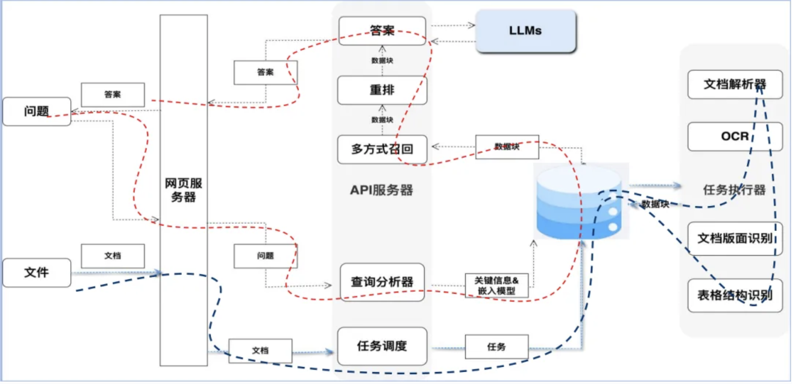

## 智能体平台，智能体，LLM，RAG，向量数据库，提示词工程

### **智能体**

​	智能体是具备环境感知、决策推理和行动执行能力的AI自治系统，可视为“会思考的24小时随时待命虚拟员工”。

​	核心能力：多模态交互、任务规划、API调用

​	例如：自动处理用户订单的电商客服机器人，结合实时数据生成投资建议的金融分析系统，自动驾驶决策系统

​	如下，在应用层实现一些能力供大模型调用，从而让它可以和 现实环境产生交互（查询数据、执行命令）


### **智能体平台**

​	智能体平台是用于构建、部署、管理和扩展智能体（Agent）的综合性系统或框架。它提供工具、基础设施和标准化流程，支持开发者快速开发智能体，并集成LLM、RAG、外部工具等组件。

#### **核心功能**

| 功能             | 说明                                                         |
| ---------------- | ------------------------------------------------------------ |
| **智能体开发**   | 提供SDK、API、低代码工具，支持定义智能体的目标、决策逻辑、工具调用等。 |
| **多智能体协作** | 支持多个智能体协同工作（如分工、通信），解决复杂任务（如供应链优化、多角色客服）。 |
| **生命周期管理** | 覆盖智能体的开发、测试、部署、监控、迭代全流程。             |
| **组件集成**     | 预集成LLM、RAG、向量数据库、API工具等，降低开发复杂度。      |
| **可扩展性**     | 支持分布式部署、负载均衡，应对高并发场景（如千万级用户的客服系统）。 |

- 商业平台

Google Dialogflow、Microsoft Bot Framework、Amazon Lex

- 开源框架

LangChain、AutoGPT、Rasa

- 企业自研

基于LLM的私有化智能体平台（如金融、医疗行业定制）

## **AI的大脑——大语言模型（LLM）**

LLM就是大家常说的"大模型"，是基于Transformer架构的深度学习模型，通过海量文本训练获得语言理解与生成能力。比如ChatGPT。它的核心能力就两点：理解人话和说人话。训练过程分两个阶段：

1. 预训练：相当于让AI上完九年义务教育，通过海量文本学习基础语言规律
2. 微调：类似专业培训，针对具体任务（比如客服、翻译）进行专项训练

- 核心能力：文本生成、逻辑推理、上下文建模

现在很多AI应用开发，其实就是通过API调取这些大模型的"脑力"。不过要注意，这些模型动辄几十亿参数（比如通义千问有70亿参数），就像个超级学霸，但需要大量算力资源供着。

## **给AI配个资料库——RAG技术**

​	大模型有个致命弱点：遇到训练数据里没有的知识就容易胡说八道（业内叫"幻觉"）。这就好比让学霸参加没复习过的考试，只能瞎蒙。


RAG技术相当于给AI配了个随身资料库。具体操作分两步：

1. 建索引：把企业私有的知识文档（比如产品手册）整理成可检索的数据库
2. 查资料：每次回答问题前先查资料库，把相关资料喂给大模型当参考



​	这招不仅减少AI瞎编的概率，还能像写论文一样给出引用来源。对企业来说，最大的好处是可以随时更新知识库，不用每次都重新训练大模型。

## **联网搜索 VS  RAG**

### **联网搜索与RAG的核心差异**

| **维度**       | **联网搜索**                         | **RAG**                                         |
| -------------- | ------------------------------------ | ----------------------------------------------- |
| **数据来源**   | 实时互联网（如Google、Bing搜索结果） | 预设的私有/领域知识库（如企业文档、专业数据库） |
| **实时性**     | 实时获取最新信息                     | 依赖知识库更新频率（可能滞后）                  |
| **数据可控性** | 信息质量不可控（含噪音、偏见）       | 数据经过清洗和结构化（高准确性）                |
| **响应速度**   | 延迟较高（需爬取+解析）              | 毫秒级响应（向量相似性检索）                    |
| **隐私与安全** | 暴露查询内容到公网                   | 本地化部署（保护敏感数据）                      |
| **成本**       | 按API调用次数计费（长期成本高）      | 一次性构建知识库（边际成本低）                  |

## **和AI沟通的艺术——提示词工程**

想要让大模型好好干活，关键要会说"提示词"。这就像和学霸同事沟通：

- 别问"这个怎么做？"（太笼统）
- 要问"用Python写个爬虫，抓取某网站商品价格，存成CSV格式，给出代码示例"

好的提示词应该包含：

1. 明确指令（做什么）
2. 具体对象（对什么做）
3. 示例参考（最好有样版）
4. 格式要求（要写成什么样）
5. 异常处理（遇到问题怎么办）

## **相互关系**

### 智能体与LLM

- 智能体使用LLM作为核心模块，处理语言理解和生成任务。

- 例如：客服智能体调用LLM分析用户问题并生成回复。

### LLM与RAG

- RAG通过增强LLM的生成过程，解决其知识局限性。

- RAG流程：用户问题 → 向量数据库检索 → LLM生成答案。

### RAG与向量数据库

- RAG依赖向量数据库检索相关知识片段。

- 例如：用向量数据库存储维基百科的文本嵌入，供RAG检索。

### 提示词工程与LLM

- 提示词工程优化LLM的输入，直接影响输出质量。

- 例如：设计结构化提示（角色、任务、格式）提升回答一致性。

## **典型应用流程**

1. 用户提问

​	智能体接收问题（如“量子计算的当前进展？”）。

2. RAG检索

​	向量数据库匹配相关文档（如最新论文摘要）。

3. 提示构造

​	提示词工程将问题+检索结果格式化为LLM输入。

4. LLM生成

​	模型基于提示生成结构化回答。

5. 智能体响应

​	返回答案并可能执行后续操作（如提供参考文献链接）。

​	智能体接收用户输入 → 用RAG检索知识 → 通过提示词工程构造输入 → LLM生成最终回答

```tex
+----------------------+
|                      |
|      用户/应用端      |  ← 交互（输入/输出）
| （如APP、网页、IoT设备）|
+----------+-----------+
           |
           | 用户提问
           v
+----------+-----------+  +-------------------+  +-------------------+
|                      |  |                   |  |                   |
|      LLM             |  |    RAG引擎        |  |   向量数据库       |
| （大语言模型）        |  | （检索增强生成）   |  | （存储知识嵌入）    |
|                      |  |                   |  |                   |
+----------+-----------+  +---------+---------+  +---------+---------+
           ↑                         ↑
           | 生成答案                | 检索增强
           +-------------------------+
                    提示词工程优化流程

           | 若RAG结果不足
           v
+----------------------+
|                      |
|    联网搜索模块       |  ← 补充实时信息
| （如Google、Bing）    |
|                      |
+----------+-----------+
           |
           | 获取实时数据
           v
+----------+-----------+
|                      |
|  LLM融合生成最终答案  |  ← 结合RAG与联网结果
|                      |
+----------------------+
           |
           | 返回用户
           v
+----------------------+
|                      |
|      用户/应用端      |  ← 接收最终答案
| （如APP、网页、IoT设备）|
+----------------------+
```

```
+----------------------+
|                      |
|      用户/应用端      |  ← 交互（输入/输出）
| （如APP、网页、IoT设备）|
+----------+-----------+
           |
           | 用户提问
           v
+----------------------+  
|                      |  
|    智能体平台         |  ← 核心调度中枢
| （Agent Platform）    |  
+----------+-----------+
           | 判断问题类型
           |
+----------v-----------+  +-------------------+  +-------------------+
|                      |  |                   |  |                   |
|      智能体集群       |  |    工具与服务     |  |    数据存储        |
| （Agents）            |  | （API、数据库等）  |  | （向量数据库、日志）|
|                      |  |                   |  |                   |
+----------+-----------+  +---------+---------+  +---------+---------+
           |                         |                       |
           | 调用                   | 读写                  | 检索/存储
           v                         v                       v
+----------+-----------+  +---------+---------+  +---------+---------+
|                      |  |                   |  |                   |
|      LLM             |  |    RAG引擎        |  |   向量数据库       |
| （大语言模型）        |  | （检索增强生成）   |  | （存储知识嵌入）    |
|                      |  |                   |  |                   |
+----------------------+  +---------+---------+  +---------+---------+
           ↑                         ↑
           | 生成答案                | 检索增强
           +-------------------------+
                    提示词工程优化流程

                      | 若RAG结果不足
                      v
+----------------------+
|                      |
|    联网搜索模块       |  ← 补充实时信息
| （如Google、Bing）    |
|                      |
+----------+-----------+
           |
           | 获取实时数据
           v
+----------+-----------+
|                      |
|  LLM融合生成最终答案  |  ← 结合RAG与联网结果
|                      |
+----------------------+
           |
           | 返回用户
           v
+----------------------+
|                      |
|      用户/应用端      |  ← 接收最终答案
| （如APP、网页、IoT设备）|
+----------------------+
```

