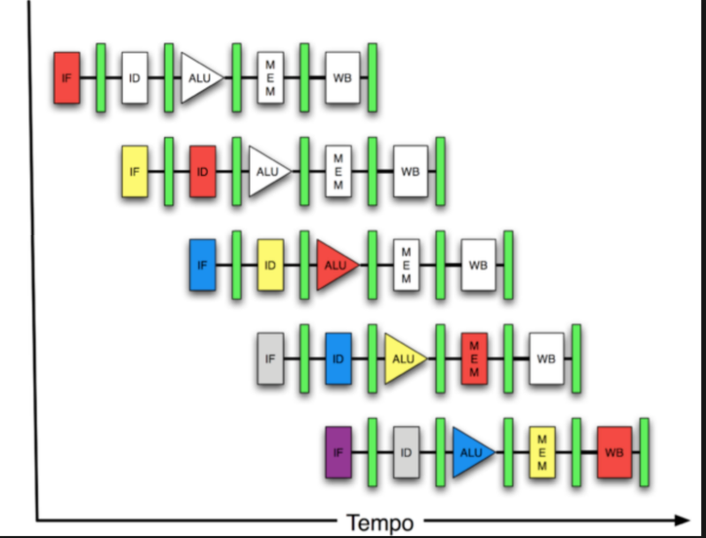
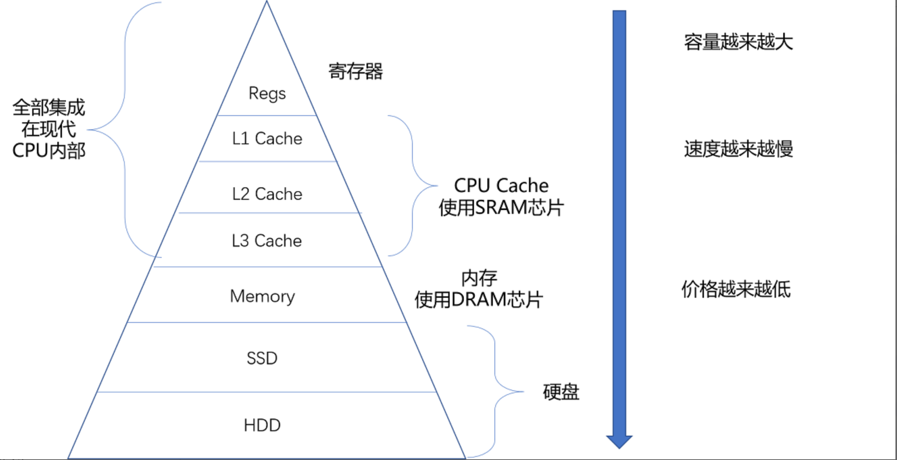
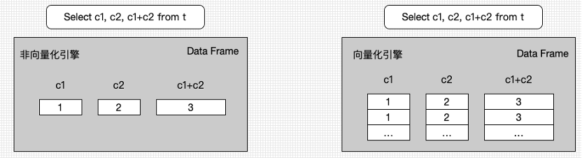
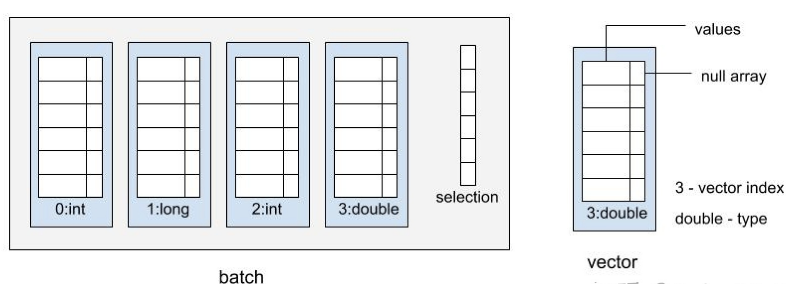

## 当代CPU特性

**超标量，流水线与乱序执行**

​	CPU指令执行可以分为多个阶段(取指令，指令译码，执行指令，访存取数和结果写回)，**流水线**的意思是指一套控制单元可以同时执行多个指令，只是每个指令处在不同的阶段，例如上一条指令处理到了取数阶段，下一条指令处理到了译码阶段。**超标量**的意思是指一个CPU核同时有多套控制单元，因此可以同时有多个流水线并发执行。CPU维护了一个**乱序执行**的指令窗口，窗口中的无数据依赖的指令就会被取来并发执行。

​	程序做好以下两个方面，可以提高超标量流水线的吞吐(IPC，每时钟周期执行指令数)。一，流水线不要断，不需要等到上一条指令执行完，就可以开始执行下一条指令。这意味着程序分支越少越好(知道下一条指令在哪)。二，并发指令越多越好。指令之间没有依赖，意味着更流畅的流水线执行，以及在多个流水线并发执行。

​		**1993 Pentium 5-stage pipeline, picture from wikibook**



这样的流水线带来了两个问题：

1. 如果一条instruction的执行必须依赖于前一条Instruction的结果，则它无法立即跟着前一条进入流水线，只能等待前一条走完整个pipeline。

2. 对于IF a THEN b ELSE c 这样的分支语句，CPU需要去预测条件的true/false，例如它预测a为false把c立刻跟随a送入流水线，但执行一些stage之后发现a是true（branch mispredicted)，但c以及后续指令已经进入了，只能flush掉整个pipeline，再从b重新开始。很明显pipeline越长，这个成本越高。而反应到数据库系统中，每个tuple的数据各有不同，这个条件a的值是很难提前预测的，这会影响到query的执行性能。

## 分支预测

​	CPU会对分支进行预测并根据预测选取下一步执行的路径，提前加载指令和数据，但如果分支预测失败，处理器要flush掉pipelines, 回滚到之前的分支，然后重新热启动，选择另一条路径，这会导致流水线中断。程序分支越少，流水线效率越高。

减少分支可以避免因分支预测失败导致的流水线中断。

​	程序分支越少，流水线效率越高。但是程序分支是不可避免的。程序分支可以分为两种，条件跳转和无条件跳转。条件跳转来自if或switch之类的语句。无条件跳转又可根据指令的操作数为跳转地址还是跳转地址指针，分为直接跳转和间接跳转。直接跳转一般为静态绑定的函数调用，间接跳转来自函数返回或虚函数之类动态绑定的函数调用。

​	当执行一个跳转指令时，在得到跳转的目的地址之前，不知道该从哪取下一条指令，流水线就只能空缺等待。为了提高这种情况下的流水线效率，CPU引入了一组寄存器，用来专门记录最近几次某个地址的跳转指令的目的地址。这样，当再一次执行到这个跳转指令时，就直接从上次保存的目的地址出取指令，放入流水线。等到真正获取到目的地址的时候，再看如果取错了，则推翻当前流水线中的指令，取真正的指令执行。

## 多级存储与数据预取



​	多级存储就不用解释了，当数据在寄存器、cache或内存中，CPU取数速度不在一个数量级。尤其cache和内存访问，相差两个数量级。CPU在内存取数的时候会首先从cache中查找数据是否存在。若不存在，则访问内存，在访问内存的同时将访问的数据所在的一个内存块一起载入cache。

​	如果程序访问数据存在线性访问的模式，CPU会主动将后续的内存块预先载入cache，这就是CPU的数据预取。有时候程序访问数据并不是线性的，例如Hash表查找等。CPU也提供了数据预取指令，程序可以事先主动将会用到的数据载入cache，这就是Software Prefetch。

​	如何利用好寄存器和cache是数据库查询执行非常重要的优化方向。

## SIMD

​	单指令多数据流，对于计算密集型程序来说，可能经常会需要对大量不同的数据进行同样的运算。SIMD引入之前，执行流程为同样的指令重复执行，每次取一条数据进行运算。例如有8个32位整形数据都需要进行移位运行，则由一条对32位整形数据进行移位的指令重复执行8次完成。SIMD引入了一组大容量的寄存器，一个寄存器包含832位，可以将这8个数据按次序同时放到一个寄存器。同时，CPU新增了处理这种832位寄存器的指令，可以在一个指令周期内完成8个数据的位移运算。

​	如何利用好SIMD也是不少数据库的优化方向，尤其是向量化执行的策略下。


## **为什么需要向量化引擎？**

​	用户希望在完成在 OLTP 联机事务处理的同时，也可以支持连接聚合等 OLAP 分析能力。而 OLAP 查询通常具有数据量大、查询复杂、耗时高的特点，所以对SQL 执行引擎的执行效率要求较高。


## **当前有哪些数据库支持向量化？**

​	OLAP数据库有很多，随着snowflake的上市市值飙升，吸引了更多的厂商加入到这个赛道，但如果说OLAP数据库不支持向量化执行器，那就少了一个最大的亮点。开源数据库里面向量化做的比较好的有ClickHouse，Apache Arrow，DuckDB（单机，CWI研究所做的，许多人可能没听过，但之前看过向量化的人可能都知道一篇论文**《MonetDB/X100: Hyper-Pipelining Query Execution》**，后面做向量化的数据库或多或少都参考了这篇论文，这个monetdb也是CWI这个研究所做的），当然国内也有Apache Doris系列。还有像国外对标snowflake的databricks，也给spark做了向量化引擎Photon（闭源），**《Photon: A Fast Query Engine for Lakehouse Systems》**。


## **向量化引擎有哪些技术价值和特点？**

### **传统火山模型的问题在哪**

​	在数据库发展早期，硬件架构还处于cpu计算能力较弱 + cache很小，主要的处理瓶颈在disk IO上，volcano的这些额外cpu代价相对来说就不那么重要。为了避免爆内存的情况出现，**每次只计算一行数据**的火山模型成为了经典的 SQL 计算引擎。火山模型又叫迭代器模型，正式提出是在 1994 年论文**《Volcano—An Extensible and Parallel Query Evaluation System》**。早期很多关系型数据库都在使用火山模型，如 Oracle、Db2、SQLServer、MySQL、PostgreSQL、MongoDB 等。

​	**对每一行数据都要调用相应的函数，函数调用开销占比高；**

​	**计算层按行处理，无法充分利用CPU cache的预读能力，造成CPU Cache miss严重；**

​	**按行处理，无法利用高效的SIMD指令。**


## **向量化引擎的技术价值**

### 1. 批量返回数据，函数调用少，提升 Cache 友好性

​	与数据库传统的火山模型迭代类似，向量化模型也是通过 PULL 模式从算子树的根节点层层拉取数据。区别于 next 调用一次传递一行数据，向量化引擎一次传递一批数据，并尽量保证该批数据在内存上紧凑排列。由于数据连续， CPU 可以通过预取指令快速把数据加载到 level 2 cache 中，减少 memory stall 现象，从而提升 CPU 的利用率。其次由于数据在内存上是紧密连续排列的，可以通过 SIMD 指令一次处理多个数据，充分发挥现代 CPU 的计算能力。

​	**向量化引擎大幅减少了框架函数的调用次数**。假设一张表有 1 亿行数据，按火山模型的处理方式需要执行 1 亿次迭代才能完成查询。使用向量化引擎返回一批数据 ，假设设置向量大小为 1024，则执行一次查询的函数调用次数降低为小于 10 万次（ 1 亿/1024 = 97657 ），大大降低了函数调用次数。在算子函数内部，函数不再一次处理一行数据，而是通过循环遍历的方式处理一批数据。通过批量处理连续数据的方式提升 CPU DCache 和 ICache 的友好性，减少 Cache Miss。

### **2、减少分支判断提升 CPU 流水处理能力**

​	论文《DBMSs On A Modern Processor: Where Does Time Go?》还介绍了分支预测失败对数据库性能的影响。由于 CPU 中断了流水执行，重新刷新流水线，因此分支预测失败对数据库处理性能的影响很大。

### **3、SIMD 指令加速计算**



​	在非向量化引擎下，一个表达式一次只能处理一个数据（Cell）（左）。向量化引擎下，每个表达式不再存储一个 Cell 数据，而是存放一组 Cell 数据，Cell 数据紧密排列（图 6 右）。这样表达式的计算都从单行计算变成了批量计算，对 CPU 的 cache 更友好，数据紧密排列也非常方便的使用 SIMD 指令进行计算加速。另外每个表达式分配 Cell 的个数即向量大小， 根据 CPU Level2 Cache 大小和 SQL 中表达式的多少动态调整。调整的原则是尽量保证参与计算的 Cell 都能存在 CPU 的level2 cache 上，减少 memory stalling 对性能的影响。


## **向量化引擎的实现**

### **1、列式存储**

**为什么必须是列存？**

​	一是列存可以减少不必要的数据存取，省去project的操作，利于压缩，当然这是列存天然优势，和向量化必要性没关系。

​	create table test(c1 int, c2 int);

​	insert into test select generate_series(1, 10000), generate_series(1, 10000);

​	场景：

​	select c1 + c2 from test where c2 > 1000;

​	行存场景在每次拿到一行数据，然后在根据每列的数据类型不同去解析出每一列的值，这里可能就会涉及到不同类型的分支处理，大量的分支会早晨分支预测失败几率变大，流水线被break，之后做计算，这个解析每列数据的操作是个比较耗时的操作，而且行存也导致了它无法利用SIMD的特性，因为SIMD需要一次操作连续内存的多个同类型值

​	而列存天然的就把每列数据分开了，我们不在需要解析的动作，一个for循环就可以处理一批数据操作，没有了大量的分支处理，有利于分支预测的成功，减少流水线的break，而且同一列数据连续存放，也可以利用SIMD指令做并行计算优化

### **2、VectorBatch**

​	采用vector-at-a-time的执行模式，即以向量（vector）为数据组织单位，使用带select-list的tuple-batch， 一个batch的大小一般会根据经验值来决定，通常为1024，2048，4096行数据，要尽量与CPU Cache Size匹配。batch由许多向量（vector）和一个selection数组而组成。其中，向量vector包括一个存储特定类型的数值列表（values）和一个标识null值位置的null数组组成，它们在内存中都是连续存储的。null数组中的bit位以0和1来区分数值列表中的某个位置是否为空值。 selection数组记录被选中的行。我们可以用vector(type, index)来标识batch中一个向量。每个向量有其特定的下标位置(index)，来表示向量在batch中的顺序；



### **3、关于selectlist过滤标识设计**

​	向量引擎的过滤标识也需要重新设计。向量引擎一次返回一批数据，该批数据内有的数据被删除掉，有的数据需要输出。如何高效的标识需要输出的数据，是一个重要的工作。论文**《Filter Representation in Vectorized Query Execution》**中介绍了目前业界的两种常用方案：

- 通过 BitMap 标记删除行：创建 bitmap， bitmap 中 bit 个数和返回数据向量大小相同。当对应 bit 为 1 时，该列需要输出，bit 为 0 时，该列被标记删除；

- 通过额外数组 Select Vector 记录输出行。需要输出的行的下标存在 Select Vector 中。

​	这两种设计每个数据库都有自己的选择，当选择率比较高的时候选bitmap的方式是比较好的，一是占用内存少，二是选择率高如果使用selectlist等于还是要逐行判断，selectlist的优势就不再明显了，虽然可以使用SIMD的gather指令来优化。

​	引入selection-vector的好处在于，不必将筛选出来的数据进行拷贝和重新编排，允许在原来的输入向量上直接计算，效率会更高。当然这也会带来一定的开销，就是有可能传递的大部分tuple都是无效的。

### **4、执行算子向量化和向量化原语**

​	使用向量化原语（vectorization primitives）来作为向量化算子的基本单位，从而构建整个向量化执行系统。原语中避免产生分支预测。其实就是一系列的类型计算函数，原语不用关注上下文信息，也不用在运行时进行类型解析和函数调用。在原始的火山模型中，使用的是行存，每行会有不同的数据类型，如果实现不好，可能行中的每种数据类型都会产生一次动态绑定。

​	数据库中有几百个函数，如果每个函数都单独做向量化处理是一个工作量巨大的工程，所以可以使用模板将相似逻辑的函数统一到一起，避免原语函数爆炸的问题。

```c++
map_plus_double_col_double_col(int n,
double*__restrict__ res,
double*__restrict__ vector1, double*__restrict__ vector2,
int*__restrict__ selection)
{
    if (selection) {
        for(int j=0;j<n; j++) {
            int i = selection[j];
            res[i] = vector1[i] + vector2[i];
        } 
    } else {
        for(int i=0;i<n; i++)
            res[i] = vector1[i] + vector2[i];
    }   
}
```


## **参考链接：**

1. https://zhuanlan.zhihu.com/p/337574939?utm_source=wechat_session&utm_medium=social&utm_oi=661899898476171264

2. https://zhuanlan.zhihu.com/p/339514444?utm_source=wechat_session&utm_medium=social&utm_oi=661899898476171264

3. http://mysql.taobao.org/monthly/2021/02/05/

4. https://mp.weixin.qq.com/s/L55W3oaJC6vrepbRcg9-tw

5. https://www.infoq.cn/news/columnar-databases-and-vectorization?utm_source=related_read_bottom&utm_medium=article

6. https://mp.weixin.qq.com/s/cq4tPEBPfKAesrgviEq1CA

7. https://www.bilibili.com/video/BV1ea41187KK?from=search&seid=12873082296374572568&spm_id_from=333.337.0.0

https://mp.weixin.qq.com/s/f3qCmaSx2z7zbpIjXJDuPg

8. https://developer.aliyun.com/article/789947

9. https://blog.csdn.net/qq_35423190/article/details/123129172

10. https://zhuanlan.zhihu.com/p/100933389

11. https://zhuanlan.zhihu.com/p/490869627

12. https://zhuanlan.zhihu.com/p/555302106

13. https://mp.weixin.qq.com/s/Qe5l7Ad-u0-9Wgr5fF43uQ

14. https://easyperf.net/blog/2017/10/24/Vectorization_part1