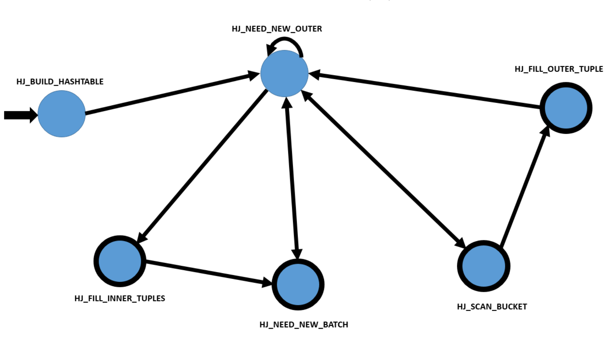
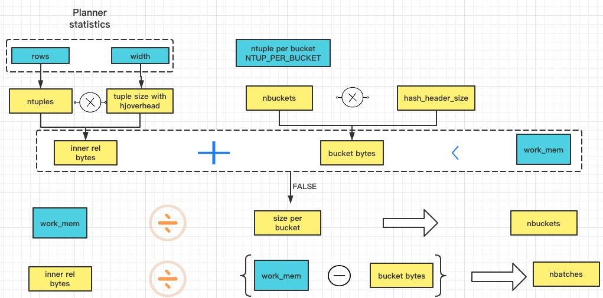
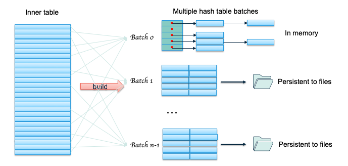
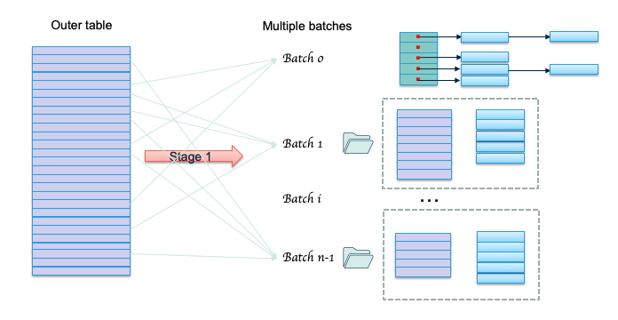

​	JOIN 有三种实现算法：**Nested Loop、Merge Join、Hash Join**。他们各有优缺点， Nestedloop通常性能不好，但是适用于任何类型的JOIN；Merge join对预排序的数据性能非常好；HashJoin对大数据量通常性能最好，但是只能处理等值条件，而不能处理像c1 > c2 这样的join条件，HashJoin是处理分析性查询的重要算子。

​	Hashjoin 是一个经典2个阶段实现，一个是 build phase，理想情况下对小表构建 hash table，该表通常也称为 inner table；第二个phase为 probe phase，扫描关联的另一张表的数据，并通过hash table 探测是否有匹配的行，该表通常称为 outer table。

```c
testdb=# explain analyze select * from t1 inner join t2 on t1.c1 = t2.c1;
                                                    QUERY PLAN
------------------------------------------------------------------------------------------------------------------
 Hash Join  (cost=270.09..2660.69 rows=11602 width=8) (actual time=10.681..83.223 rows=20016 loops=1)
   Hash Cond: (t1.c1 = t2.c1)
   ->  Seq Scan on t1  (cost=0.00..1587.05 rows=110005 width=4) (actual time=0.023..26.011 rows=110005 loops=1)
   ->  Hash  (cost=145.04..145.04 rows=10004 width=4) (actual time=10.274..10.274 rows=10003 loops=1)
          Buckets: 32768  Batches: 1  Memory Usage: 352kB
         ->  Seq Scan on t2  (cost=0.00..145.04 rows=10004 width=4) (actual time=0.018..3.840 rows=10004 loops=1)
 Total runtime: 86.694 ms
(7 rows)
```

### **batch是什么？**

sort，hashjoin，agg这类算子是需要缓存数据的，但内存是有限的，不太可能说永远保证可以容纳下所有的数据，所以MogDB通过一个guc参数**work_mem**默认为64M来控制这类算子可用的内存上限，如果超过这个上限值，就要把数据切到磁盘上，这样就可以避免**out of memory**之类的错误，hashjoin中在内存足够的情况batch的数量是1(全内存场景)，当内存不足时，这个batch的数量就会大于1

**tips:**

当发现hashjoin的性能很差的时候，首先要看的就是explain analyze这里的Batch是不是大于1，也就是是不是切磁盘了。

### **HashJoin的状态机**



​	其中单箭头是指箭头尾巴的状态在一定条件下会转移到箭头状态，双箭头指的是这两个状态可以互相转化，指向自身的箭头是只自身在做一些处理之后继续回到自身状态，此时内部会再次check是否满足转移条件。粗粗的黑圈指的是终结状态，也就是说在这个状态下程序可以结束并且输出JOINed tuple。

- 第一个状态是**HJ_BUILD_HASHTABLE**节点，即为inner tuples构造hashtable；
- 完成了第一步，也就有了inner tuples构成的hashtable， 这时候我们就需要outer tuples了。所以到了**HJ_NEED_NEW_OUTER**节点。在这个节点我们会去获取outer tuple，如果获取不到，那么我们就要根据情况，如果是RIGHT或者FULL JOIN则去**HJ_FILL_INNER_TUPLES**节点填充空tuple，要么去**HJ_NEED_NEW_BATCH**节点。反之，如果获取到了outer tuple的话，跳转至**HJ_SCAN_BUCKET**或者再走一次**HJ_NEED_NEW_OUTER**（切磁盘场景如果当前tuple不属于当前batch，则写盘继续读取外表）;
- 接下来是**HJ_SCAN_BUCKET**节点，到这个节点的话，outer tuple都搞定了，那么我们需要在hash表中查找该外表tuple是否存在匹配的情况，如果没有则继续去**HJ_FILL_OUTER_TUPLE**，如果取到了并且满足连接条件的话，且不是ANTI JOIN的话(ANTI JOIN 需要丢掉inner 和outer匹配的连接)，就可以到此结束返回JOINed tuple了。
- 然后是**HJ_FILL_OUTER_TUPLE**节点，到了这里说明inner 和outer没有匹配上，那么我们应该是要去获取下一个outer tuple，也就是说，要去**HJ_NEED_NEW_OUTER**，但是如果我们要是可以返回T1 join NULL这种元组的话(也就是满足left join或者full join)，也是要返回的，因为这也是我们需要的结果。所以这里多了这个状态，如果当前情况可以返回的话，那就返回。
- 上面说的是outer，**HJ_FILL_INNER_TUPLES**就是处理inner的情况。这里如果是右外连接或者全连接的话，我们是需要左表补空，这里我们就一直获取batch中的inner tuple。直到这个batch用完了，我们要在进入下一个batch，所以最后进入**HJ_NEED_NEW_BATCH**节点。这个节点不断地获取下一个batch。当我们获取完了。说明这一波刷完了。那么进入下一波，又到了**HJ_NEED_NEW_OUTER**。

### **build阶段**

​	**hashjoin中的hash表是通过拉链法实现**

​	key：通过每个列类型的hash函数对该列数据进行hash运算得到的值

​	value：MinimalTuple

```c
 typedef struct HashJoinTupleData {
    struct HashJoinTupleData* next; /* link to next tuple in same bucket */
    uint32 hashvalue;               /* tuple's hash code */
                                    /* Tuple data, in MinimalTuple format, follows on a MAXALIGN boundary */
} HashJoinTupleData;

typedef struct HashJoinTableData {
    int nbuckets;      /* # buckets in the in-memory hash table */
    /* buckets[i] is head of list of tuples in i'th in-memory bucket */
    struct HashJoinTupleData** buckets;
    ...
} HashJoinTableData;

 [HashJoinTupleData*]
 [HashJoinTupleData*]->[HashJoinTupleData*]->[HashJoinTupleData*]->....
 [HashJoinTupleData*]
 ...
 
/* hash表中插入数据 */
/* 前面内存用来记录HashJoinTupleData结构体，后面记录MinimalTuple */
hashTupleSize = HJTUPLE_OVERHEAD + tuple->t_len;
hashTuple = (HashJoinTuple)dense_alloc(hashtable, hashTupleSize);
hashTuple->hashvalue = hashvalue;
errorno = memcpy_s(HJTUPLE_MINTUPLE(hashTuple), tuple->t_len, tuple, tuple->t_len);
```

该状态需要确定两个值，一个是**batch数量**（是否需要切磁盘），一个是**bucket数量**（hash表的桶数）

①首先估算内表数据所需内存空间(inner_rel_bytes)

②估算bucket占用的空间大小

③估算桶数，计算所有bucket的空间。

④顺序获取内表中的所有元组，对每一条元组进行Hash,并通过Hash结果获取块号和桶号。对于块号为0的元组，放人内存对应的桶内；否则放入为右关系每个块分别建立的临时文件中。此时，标记当前在内存中的块号curbatch为0。



**备注：**

​	对于一个Hash值为hashvalue的元组，其所属的分块号为(hashvalue/nbucket)%nbatch,其对应的桶号为hashvalue%nbucket。

​	为了能够使用位操作(位与和移位)实现取模和取余操作，将nbatch和nbucket取为不小于计算值的2的n次,并使得2^log2_nbuckets = nbucket,则块号的计算方法为(hashvalue >> log2_nbuckets)&(nbatch - 1)，桶号计算式为hashvalue&(nbucket - 1)。

```C
HashJoinTable ExecHashTableCreate(Hash* node, List* hashOperators, bool keepNulls)
{
    ...
    /* 计算batch和bucket */
    ExecChooseHashTableSize(PLAN_LOCAL_ROWS(outerNode) / SET_DOP(node->plan.dop),
        outerNode->plan_width,
        OidIsValid(node->skewTable),
        &nbuckets,
        &nbatch,
        &num_skew_mcvs,
        local_work_mem);
    ...
    /* 如果batch大于1，说明需要切磁盘，准备临时文件空间 */
    if (nbatch > 1) {
        /*
         * allocate and initialize the file arrays in hashCxt
         */
        hashtable->innerBatchFile = (BufFile**)palloc0(nbatch * sizeof(BufFile*));
        hashtable->outerBatchFile = (BufFile**)palloc0(nbatch * sizeof(BufFile*));
        /* The files will not be opened until needed... */
        /* ... but make sure we have temp tablespaces established for them */
        PrepareTempTablespaces();
    }

    /*
     * Set up for skew optimization, if possible and there's a need for more
     * than one batch.	(In a one-batch join, there's no point in it.)
     */
    if (nbatch > 1)
        ExecHashBuildSkewHash(hashtable, node, num_skew_mcvs);

    MemoryContextSwitchTo(oldcxt);

    return hashtable;
}

/* 扫描Hash子节点，将数据插入到hash表或者临时文件 */
Node* MultiExecHash(HashState* node)
{
    ...
    for (;;) {
        slot = ExecProcNode(outerNode);
        if (unlikely(node->cbstate)){
            slot = node->cbstate->call_back(node->cbstate, slot);
        }
        if (TupIsNull(slot))
            break;
        /* We have to compute the hash value */
        econtext->ecxt_innertuple = slot;
        if (ExecHashGetHashValue(hashtable, econtext, hashkeys, false, hashtable->keepNulls, &hashvalue)) {
            int bucketNumber;

            bucketNumber = ExecHashGetSkewBucket(hashtable, hashvalue);
            if (bucketNumber != INVALID_SKEW_BUCKET_NO) {
                /* It's a skew tuple, so put it into that hash table */
                ExecHashSkewTableInsert(hashtable, slot, hashvalue, bucketNumber);
            } else {
                /* Not subject to skew optimization, so insert normally */
                ExecHashTableInsert(hashtable,
                    slot,
                    hashvalue,
                    node->ps.plan->plan_node_id,
                    SET_DOP(node->ps.plan->dop),
                    node->ps.instrument);
            }
            hashtable->totalTuples += 1;
        }
    }
    ...
}
```

```c
void ExecChooseHashTableSize(double ntuples, int tupwidth, bool useskew, int* numbuckets, int* numbatches,
    int* num_skew_mcvs, int4 localWorkMem, bool vectorized, OpMemInfo* memInfo)
{
    ...
    if (vectorized) {
        tupsize = sizeof(void*) + MAXALIGN(tupwidth);
    } else {
        /* 哈希表中单行tuple的占用空间 */
        tupsize = HJTUPLE_OVERHEAD + MAXALIGN(sizeof(MinimalTupleData)) + MAXALIGN(tupwidth);
    }
    inner_rel_bytes = ntuples * tupsize; // 估算出来的内表大小，ntuples就是planner估算出来的那个该表的行数

    hash_table_bytes = localWorkMem * 1024L;
    
    /* skew optimization */
    if (useskew) {
        skew_table_bytes = hash_table_bytes * SKEW_WORK_MEM_PERCENT / 100;
        *num_skew_mcvs =
            skew_table_bytes / (tupsize + (8 * sizeof(HashSkewBucket*)) + sizeof(int) + SKEW_BUCKET_OVERHEAD);
        if (*num_skew_mcvs > 0) {
            hash_table_bytes -= skew_table_bytes;
        }
    } else {
        *num_skew_mcvs = 0;
    }
    
    ...
    max_pointers = (localWorkMem * 1024L) / hash_header_size;
    max_pointers = Min(max_pointers, (long)(MaxAllocSize / hash_header_size));
    /*  If max_pointers isn't a power of 2, must round it down to one */
    mppow2 = 1UL << my_log2(max_pointers);
    if (max_pointers != mppow2) {
        max_pointers = mppow2 / 2;
    }

    /* Also ensure we avoid integer overflow in nbatch and nbuckets */
    /* (this step is redundant given the current value of MaxAllocSize) */
    max_pointers = Min(max_pointers, INT_MAX / 2);
    /* 因为一个桶就是一个HashJoinTupleData*指针，首先算出在内存允许情况下，可以得到的最大的数量是多少 */
    
    /* NTUP_PER_BUCKET默认是1，之后我们用估算出的行数算一个桶数 */
    dbuckets = ceil(ntuples / NTUP_PER_BUCKET);
    dbuckets = Min(dbuckets, max_pointers);
    nbuckets = (int)dbuckets;
    /* don't let nbuckets be really small, though ... */
    nbuckets = Max(nbuckets, MIN_HASH_BUCKET_SIZE);
    /* ... and force it to be a power of 2. */
    nbuckets = 1 << my_log2(nbuckets);

    /*
     * If there's not enough space to store the projected number of tuples and
     * the required bucket headers, we will need multiple batches.
     */
    bucket_bytes = ((int64)hash_header_size) * nbuckets;   /* 桶占用的空间 */
    
    /* 大于work_mem，则说明纯内存不足以容纳下所有数据，需要切磁盘来避免out of memory */
    if (inner_rel_bytes + bucket_bytes > hash_table_bytes) {
        /* We'll need multiple batches */
        int64 lbuckets;
        double dbatch;
        int minbatch;
        double max_batch;
        int64 bucket_size;

        /*
         * 估计work_mem完全用完时的桶数。
         * 每个桶将包含一个桶指针和NTUP_PER_BUCKET个元组，
         */
        bucket_size = ((int64)tupsize * NTUP_PER_BUCKET + hash_header_size);
        lbuckets = 1UL << my_log2(hash_table_bytes / bucket_size);
        lbuckets = Min(lbuckets, max_pointers);
        nbuckets = (int)lbuckets;
        nbuckets = 1 << my_log2(nbuckets);
        bucket_bytes = (int64)nbuckets * hash_header_size;

        /*
         * Buckets are simple pointers to hashjoin tuples, while tupsize
         * includes the pointer, hash code, and MinimalTupleData.  So buckets
         * should never really exceed 25% of work_mem (even for
         * NTUP_PER_BUCKET=1); except maybe for work_mem values that are not
         * 2^N bytes, where we might get more because of doubling. So let's
         * look for 50% here.
         */
        Assert(bucket_bytes <= hash_table_bytes / 2);

        /* Calculate required number of batches. */
        dbatch = ceil(inner_rel_bytes / (hash_table_bytes - bucket_bytes));
        dbatch = Min(dbatch, max_pointers);
        minbatch = (int)dbatch;
        nbatch = 2;
        while (nbatch < minbatch) {
            nbatch <<= 1;
        }

        /*
         * This Min() steps limit the nbatch so that the pointer arrays
         * we'll try to allocate do not exceed MaxAllocSize.
         */
        max_batch = (MaxAllocSize + 1) / sizeof(BufFile*) / 2;
        nbatch = (int)Min(nbatch, max_batch);
    }

    Assert(nbuckets > 0);
    Assert(nbatch > 0);

    *numbuckets = nbuckets;
    *numbatches = nbatch;
    ...       
}
```

### **探测阶段：**

①从外表中获取元组，进行Hash,获取元组块号和桶号。当块号等于当前在内存中的块号时,直接扫描对应的桶，找寻满足条件的元组并进行连接；否则，将其存到为外表每个块建立的临时文件中。直到外表被扫描完毕。

②当前batch结束后，从内表的块号curbatch + 1对应的临时文件中读取所有元组将其Hash到相应的桶内，并将curbatch加1。

③从外表的块号curbatch对应的临时文件中依次读取所存储的元组，计算其桶号，并扫描桶中内表的元组，寻找满足连接条件的元组进行连接。

④重复步骤2和3，直到所有的块都被扫描结束。


### OpenGauss **hashjoin有三种实现：**

#### 1. 内存版本的In Memory Hash Join算法

```c
for each row R1 in the build table
    begin
        calculate hash value on R1 join key(s)
        insert R1 into the appropriate hash bucket
    end
for each row R2 in the probe table
    begin
        calculate hash value on R2 join key(s)
        for each row R1 in the corresponding hash bucket
            if R1 joins with R2
                return (R1, R2)
    end
```

​	内存版本的实现看起来非常直观，却没有考虑一个问题：如果inner table 太大不能放到内存中怎么办？这就引出了hashjoin的第二个实现版本。

#### **2. 内存不足后Hybrid Hash Join算法**

​	Hybrid hash join 是经典的解决内存不足情况下的hashjoin算法，把inner table 和outer table 按照关联键分成多个分区（这个分区数就是创建hashtable的时候算出来的batch数），每个分区的数据保存到磁盘上，然后对每个分区应用第一个版本的 hash join 算法。每个分区是一个 batch（一次批处理）。这里有一个优化就是第一个batch不比写入磁盘，可以避免第一个batch的磁盘IO。

**Hybrid hash join实现流程：**

- 首先对 inner table分batch，根据前面计算的算法计算batchno，如果tuple属于batch 0，则加入内存中的hashtable中，否则则写入该batch对应的磁盘文件中。batch 0不用写入磁盘文件中。



- 然后对 outer table 进行分batch，如果outer table 的tuple计算后属于 batch 0，则执行前面提到的hashjoin算法：判断hashtable中是否存在匹配该outer tuple的inner tuple，如果存在且满足所有where条件，则找到了一个匹配，输出结果，否则继续下一个tuple。如果outer tuple不属于batch 0，则将该tuple写入该batch对应的外表磁盘文件中。

    

- Outer table 扫描结束时， batch 0也处理完了。继续处理 batch 1：加载 batch 1 的inner table临时数据到内存中，构建hashtable，然后扫描外表对应的batch 1文件，执行前面的probe 操作。完成batch 1 后，继续处理 batch 2，直到完成所有的batches。当然这里还是可能出现某一个batch的数据还是无法在内存中全部容纳下，这时候就继续把batch数目从n变成2n，重新扫描并计算内表的该batch数据，如果仍然属于该batch，则保留在内存中，否则写入到文件中。由于 batch 数目发生了变化，那么有些batch 里面的tuple可能会不在属于当前batch。

Hybrid hash join 算法（取模操作）确保，batch 数目翻倍后，tuple 所属 batch 只会向后，而不会向前。

#### **3. Hybrid Hash Join优化版**

这个优化是对倾斜数据的优化。

**该优化只有在如下场景下才会生效：**

1. 连接条件必须只有1个

2. 连接条件必须是OpExpr类型

3. 连接条件左参数必须是普通列引用类型

```c
  if (list_length(hashclauses) == 1) {
        OpExpr* clause = (OpExpr*)linitial(hashclauses);
        Node* node = NULL;

        Assert(is_opclause(clause));
        node = (Node*)linitial(clause->args);
        if (IsA(node, RelabelType))
            node = (Node*)((RelabelType*)node)->arg;
        if (IsA(node, Var)) {
            Var* var = (Var*)node;
            RangeTblEntry* rte = NULL;

            rte = root->simple_rte_array[var->varno];
            if (rte->rtekind == RTE_RELATION) {
                skewTable = rte->relid;
                skewColumn = var->varattno;
                skewInherit = rte->inh;
                skewColType = var->vartype;
                skewColTypmod = var->vartypmod;
            }
        }
    }
```

​	Skew优化的核心思想是尽量避免磁盘io：在 batch 0阶段处理outer table最常见的 （MCV，Most common value） 数据。选择 outer table 的MCV而不是inner table的 MCV的原因是优化器通常选择小表和正态分布的表做 inner table，这样outer table会更大，或者更大概率是非正态分布。

​	首先是准备 skew hash table，包括三个步骤：

- 确定 skew hash table 的大小。MogDB 默认分配2% 的内存构建skew hash table，并计算能容纳多少 MCV tuples。

    ```c
     /* skew optimization */
        if (useskew) {
            skew_table_bytes = hash_table_bytes * SKEW_WORK_MEM_PERCENT / 100;   // SKEW_WORK_MEM_PERCENT为2
            /* ----------
             * Divisor is:
             * size of a hash tuple +
             * worst-case size of skewBucket[] per MCV +
             * size of skewBucketNums[] entry +
             * size of skew bucket struct itself
             * ----------
             */
             // hashtable->skewBucket的指针数量将是允许的mcv数量的8倍
            *num_skew_mcvs =
                skew_table_bytes / (tupsize + (8 * sizeof(HashSkewBucket*)) + sizeof(int) + SKEW_BUCKET_OVERHEAD);
            if (*num_skew_mcvs > 0) {
                hash_table_bytes -= skew_table_bytes;
            }
        } else {
            *num_skew_mcvs = 0;
        }
    ```

- 根据 pg_statistic syscache 数据，获得 outer table 的MCV 统计信息，对每个mcv，计算其hash值，并放到其对应skew hash bucket 中，现在还没有处理inner table，所以该 bucket 指向 NULL。hash冲突解决方案是线性增长，如果当前slot被占用了，则占用下一个。

    这是SkewHash表和上面内存版本的区别，它使用的是开放地址的方式实现的

    ```c
    static void ExecHashBuildSkewHash(HashJoinTable hashtable, Hash* node, int mcvsToUse)
    {
           /*
         * Try to find the MCV statistics for the outer relation's join key.
         *
         * Note: We don't consider multi-column skew-optimization values here(improve later)
         */
        statsTuple = SearchSysCache4(STATRELKINDATTINH,
                                    ObjectIdGetDatum(node->skewTable),
                                    CharGetDatum(stakind),
                                    Int16GetDatum(node->skewColumn),
                                    BoolGetDatum(node->skewInherit));
        if (!HeapTupleIsValid(statsTuple)) {
            return;
        }
    
        if (get_attstatsslot(statsTuple,
                            node->skewColType,
                            node->skewColTypmod,
                            STATISTIC_KIND_MCV,
                            InvalidOid,
                            NULL,
                            &values,
                            &nvalues,
                            &numbers,
                            &nnumbers)) {
            double frac;
            int nbuckets;
            FmgrInfo* hashfunctions = NULL;
            int i;
    
            if (mcvsToUse > nvalues) {
                mcvsToUse = nvalues;
            }
    
            /*
             * Calculate the expected fraction of outer relation that will
             * participate in the skew optimization.  If this isn't at least
             * SKEW_MIN_OUTER_FRACTION, don't use skew optimization.
             */
            frac = 0;
            for (i = 0; i < mcvsToUse; i++) {
                frac += numbers[i];
            }
            if (frac < SKEW_MIN_OUTER_FRACTION) {
                free_attstatsslot(node->skewColType, values, nvalues, numbers, nnumbers);
                ReleaseSysCache(statsTuple);
                return;
            }
         }
         ...
         for (i = 0; i < mcvsToUse; i++) {
                uint32 hashvalue;
                int bucket;
    
                hashvalue = DatumGetUInt32(FunctionCall1(&hashfunctions[0], values[i]));
    
                /*
                 * While we have not hit a hole in the hashtable and have not hit
                 * the desired bucket, we have collided with some previous hash
                 * value, so try the next bucket location.	NB: this code must
                 * match ExecHashGetSkewBucket.
                 */
                bucket = hashvalue & (nbuckets - 1);
                while (hashtable->skewBucket[bucket] != NULL && hashtable->skewBucket[bucket]->hashvalue != hashvalue) {
                    bucket = (bucket + 1) & (nbuckets - 1);
                }
    
                /*
                 * If we found an existing bucket with the same hashvalue, leave
                 * it alone.  It's okay for two MCVs to share a hashvalue.
                 */
                if (hashtable->skewBucket[bucket] != NULL) {
                    continue;
                }
    
                /* Okay, create a new skew bucket for this hashvalue. */
                hashtable->skewBucket[bucket] =
                    (HashSkewBucket*)MemoryContextAlloc(hashtable->batchCxt, sizeof(HashSkewBucket));
                hashtable->skewBucket[bucket]->hashvalue = hashvalue;
                hashtable->skewBucket[bucket]->tuples = NULL;
                hashtable->skewBucketNums[hashtable->nSkewBuckets] = bucket;
                hashtable->nSkewBuckets++;
                hashtable->spaceUsed += SKEW_BUCKET_OVERHEAD;
                hashtable->spaceUsedSkew += SKEW_BUCKET_OVERHEAD;
                if (hashtable->spaceUsed > hashtable->spacePeak) {
                    hashtable->spacePeak = hashtable->spaceUsed;
                }
            }
            ...
    }
    ```

- 填充skew hash table：扫描inner table 构建main hashtable 时，如果当前tuple 属于skew hash table，则加入到skew hashtable 。

    ```c++
    static void ExecHashSkewTableInsert(HashJoinTable hashtable, TupleTableSlot* slot, uint32 hashvalue, int bucketNumber)
    {
        ...
    }
    ```

    ​	扫描outer table 时，如果是 MCV tuple，则使用skew hash table进行处理。 否则按照前面介绍的Hybrid hash join 算法处理。假设使用 skew 优化，大部分常见的数据就会在batch0处理，这样就节约了大部分的磁盘IO。

    ### hashjoin算法是通过**ExecHashJoin**函数实现的

    ```c
    TupleTableSlot* ExecHashJoin(HashJoinState* node)
    {
        ...
        /*
         * run the hash join state machine
         */
        for (;;) {
            switch (node->hj_JoinState) {
                case HJ_BUILD_HASHTABLE: {
                    ...
                    oldcxt = MemoryContextSwitchTo(hashNode->ps.nodeContext);
                    /* 创建hash表，计算bucket和batch数，如果需要切磁盘，初始化磁盘空间，如果skew优化成立，初始化skew哈希表 */
                    hashtable = ExecHashTableCreate((Hash*)hashNode->ps.plan, node->hj_HashOperators,
                        HJ_FILL_INNER(node) || node->js.nulleqqual != NIL);
                    MemoryContextSwitchTo(oldcxt);
                    node->hj_HashTable = hashtable;
                    
                    /* Hash算子，遍历内表插入到hash表或者插入到临时文件batch中 */
                    (void)MultiExecProcNode((PlanState*)hashNode); 
    
                    /*
                     * need to remember whether nbatch has increased since we
                     * began scanning the outer relation
                     */
                    hashtable->nbatch_outstart = hashtable->nbatch;
    
                    node->hj_JoinState = HJ_NEED_NEW_OUTER;
                }
                /* fall through */
                case HJ_NEED_NEW_OUTER:
    
                    /*
                     * We don't have an outer tuple, try to get the next one
                     */
                    outerTupleSlot = ExecHashJoinOuterGetTuple(outerNode, node, &hashvalue);
                    if (TupIsNull(outerTupleSlot)) {
                        /* end of batch, or maybe whole join */
                        if (HJ_FILL_INNER(node)) {
                            /* set up to scan for unmatched inner tuples */
                            /* 右外或者全外连接，补空 */
                            ExecPrepHashTableForUnmatched(node);
                            node->hj_JoinState = HJ_FILL_INNER_TUPLES;
                        } else
                            node->hj_JoinState = HJ_NEED_NEW_BATCH;  //  下一批次数据
                        continue;
                    }
    
                    econtext->ecxt_outertuple = outerTupleSlot;
                    node->hj_MatchedOuter = false;
    
                    /*
                     * Find the corresponding bucket for this tuple in the main
                     * hash table or skew hash table.
                     */
                    node->hj_CurHashValue = hashvalue;
                    ExecHashGetBucketAndBatch(hashtable, hashvalue, &node->hj_CurBucketNo, &batchno);
                    node->hj_CurSkewBucketNo = ExecHashGetSkewBucket(hashtable, hashvalue);
                    node->hj_CurTuple = NULL;
    
                    /*
                     * The tuple might not belong to the current batch (where
                     * "current batch" includes the skew buckets if any).
                     */
                    if (batchno != hashtable->curbatch && node->hj_CurSkewBucketNo == INVALID_SKEW_BUCKET_NO) {
                        /*
                         * Need to postpone this outer tuple to a later batch.
                         * Save it in the corresponding outer-batch file.
                         */
                        Assert(batchno > hashtable->curbatch);
                        MinimalTuple tuple = ExecFetchSlotMinimalTuple(outerTupleSlot);
                        ExecHashJoinSaveTuple(tuple, hashvalue, &hashtable->outerBatchFile[batchno]);
                        *hashtable->spill_size += sizeof(uint32) + tuple->t_len;
                        pgstat_increase_session_spill_size(sizeof(uint32) + tuple->t_len);
    
                        /* Loop around, staying in HJ_NEED_NEW_OUTER state */
                        continue;
                    }
    
                    /* OK, let's scan the bucket for matches */
                    node->hj_JoinState = HJ_SCAN_BUCKET;
    
                    /* Prepare for the clear-process if necessary */
                    if (jointype == JOIN_RIGHT_ANTI || jointype == JOIN_RIGHT_SEMI)
                        node->hj_PreTuple = NULL;
    
                    /* fall through */
                case HJ_SCAN_BUCKET:
    
                    /*
                     * We check for interrupts here because this corresponds to
                     * where we'd fetch a row from a child plan node in other join
                     * types.
                     */
                    CHECK_FOR_INTERRUPTS();
    
                    /* 是否可以在对应bucket中匹配到 */
                    if (!ExecScanHashBucket(node, econtext)) {
                        /* out of matches; check for possible outer-join fill */
                        node->hj_JoinState = HJ_FILL_OUTER_TUPLE;
                        continue;
                    }
                    /* 匹配成功，判断是否可以满足连接条件 */
                    if (joinqual == NIL || ExecQual(joinqual, econtext, false)) {
                        node->hj_MatchedOuter = true;
    
                        /*
                         * for right-anti join: skip and delete the matched tuple;
                         * for right-semi join: return and delete the matched tuple;
                         * for right-anti-full join: skip and delete the matched tuple;
                         */
                        if (jointype == JOIN_RIGHT_ANTI || jointype == JOIN_RIGHT_SEMI ||
                            jointype == JOIN_RIGHT_ANTI_FULL) {
                            if (node->hj_PreTuple)
                                node->hj_PreTuple->next = node->hj_CurTuple->next;
                            else if (node->hj_CurSkewBucketNo != INVALID_SKEW_BUCKET_NO)
                                hashtable->skewBucket[node->hj_CurSkewBucketNo]->tuples = node->hj_CurTuple->next;
                            else
                                hashtable->buckets[node->hj_CurBucketNo] = node->hj_CurTuple->next;
                            if (jointype == JOIN_RIGHT_ANTI || jointype == JOIN_RIGHT_ANTI_FULL)
                                continue;
                        } else {
                            HeapTupleHeaderSetMatch(HJTUPLE_MINTUPLE(node->hj_CurTuple));
    
                            /* Anti join: we never return a matched tuple */
                            if (jointype == JOIN_ANTI || jointype == JOIN_LEFT_ANTI_FULL) {
                                node->hj_JoinState = HJ_NEED_NEW_OUTER;
                                continue;
                            }
    
                            /* Semi join: we'll consider returning the first match, but after
                             *	that we're done with this outer tuple */
                            if (jointype == JOIN_SEMI)
                                node->hj_JoinState = HJ_NEED_NEW_OUTER;
                        }
    
                        if (otherqual == NIL || ExecQual(otherqual, econtext, false)) {
                            TupleTableSlot* result = NULL;
    
                            result = ExecProject(node->js.ps.ps_ProjInfo, &isDone);
    
                            if (isDone != ExprEndResult) {
                                node->js.ps.ps_TupFromTlist = (isDone == ExprMultipleResult);
                                return result;
                            }
                        } else
                            InstrCountFiltered2(node, 1);
                    } else {
                        InstrCountFiltered1(node, 1);
                        /* For right Semi/Anti join, we set hj_PreTuple following hj_CurTuple */
                        if (jointype == JOIN_RIGHT_ANTI || jointype == JOIN_RIGHT_SEMI)
                            node->hj_PreTuple = node->hj_CurTuple;
                    }
                    break;
    
                case HJ_FILL_OUTER_TUPLE:
    
                    /* 左外或者全外连接，补空 */
                    /*
                     * The current outer tuple has run out of matches, so check
                     * whether to emit a dummy outer-join tuple.  Whether we emit
                     * one or not, the next state is NEED_NEW_OUTER.
                     */
                    node->hj_JoinState = HJ_NEED_NEW_OUTER;
    
                    if (!node->hj_MatchedOuter && HJ_FILL_OUTER(node)) {
                        /*
                         * Generate a fake join tuple with nulls for the inner
                         * tuple, and return it if it passes the non-join quals.
                         */
                        econtext->ecxt_innertuple = node->hj_NullInnerTupleSlot;
    
                        if (otherqual == NIL || ExecQual(otherqual, econtext, false)) {
                            TupleTableSlot* result = NULL;
    
                            result = ExecProject(node->js.ps.ps_ProjInfo, &isDone);
    
                            if (isDone != ExprEndResult) {
                                node->js.ps.ps_TupFromTlist = (isDone == ExprMultipleResult);
                                return result;
                            }
                        } else
                            InstrCountFiltered2(node, 1);
                    }
                    break;
    
                case HJ_FILL_INNER_TUPLES:
    
                    /* 右外或者全外连接，补空 */
                    /*
                     * We have finished a batch, but we are doing right/full/rightAnti join,
                     * so any unmatched inner tuples in the hashtable have to be
                     * emitted before we continue to the next batch.
                     */
                    if (!ExecScanHashTableForUnmatched(node, econtext)) {
                        /* no more unmatched tuples */
                        node->hj_JoinState = HJ_NEED_NEW_BATCH;
                        continue;
                    }
    
                    /*
                     * Generate a fake join tuple with nulls for the outer tuple,
                     * and return it if it passes the non-join quals.
                     */
                    econtext->ecxt_outertuple = node->hj_NullOuterTupleSlot;
    
                    if (otherqual == NIL || ExecQual(otherqual, econtext, false)) {
                        TupleTableSlot* result = NULL;
    
                        result = ExecProject(node->js.ps.ps_ProjInfo, &isDone);
    
                        if (isDone != ExprEndResult) {
                            node->js.ps.ps_TupFromTlist = (isDone == ExprMultipleResult);
                            return result;
                        }
                    } else
                        InstrCountFiltered2(node, 1);
                    break;
    
                case HJ_NEED_NEW_BATCH:
                    /* 或者下一批次数据 */
                    /*
                     * Try to advance to next batch.  Done if there are no more.
                     */
                    if (!ExecHashJoinNewBatch(node)) {
                        ExecEarlyFree(outerPlanState(node));
                        EARLY_FREE_LOG(elog(LOG, "Early Free: HashJoin Probe is done"
                            " at node %d, memory used %d MB.",
                            (node->js.ps.plan)->plan_node_id, getSessionMemoryUsageMB()));
    
                        return NULL; /* end of join */
                    }
                    node->hj_JoinState = HJ_NEED_NEW_OUTER;
                    break;
    
                default:
                    ereport(ERROR, (errcode(ERRCODE_UNEXPECTED_NODE_STATE),
                            errmodule(MOD_EXECUTOR), errmsg("unrecognized hashjoin state: %d", (int)node->hj_JoinState)));
            }
        }
    }
    ```

    