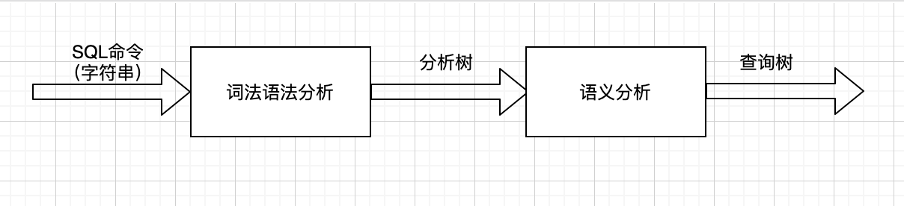
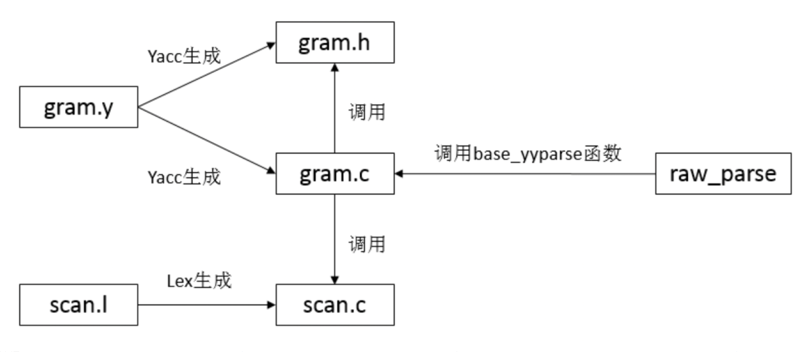

## postgres/openGauss解析器(词法语法语义)处理流程
### Lex&YACC or Flex&Bison
####	它们是什么关系？
​		Flex就是由Vern Paxon实现的一个Lex，Bison则是GNU版本的YACC，flex和bison是GNU/Linux下的Lex&YACC。
#### 	它们可以做什么？
​		可以解析语言，打造自己的解析器。

### postgreSQL解析器
​	backend进程收到client传过来的SQL字符串之后，传递给parser，词法分析器(scan.l)将字符串打散成一个个的token（单词），语法分析器依次读取token并适配对应的语法规则(gram.y)然后生成抽象语法树。
​	语义分析模块收到抽象语法树做相应转换处理生成查询树传递给优化器。



###	代码路径

​		相关代码在`src/backend/parser`下的`scan.l`和`gram.y`。

#### parser.c
  解析器的入口，入口函数为`raw_parser`，负责调用词法分析器scan.l、语法分析器gram.y和语义分析器analyze.c。
##### scan.l
  词法分析器，通过flex工具，识别标识符，SQL关键字等，对于发现的每个关键字或者标识符都会生成一个记号并且传递给语法分析器。
#### gram.y
  语法分析器，包含一套语法规则和触发规则时执行的动作，通过Bison工具将词法传过来的tokens解析为抽象语法树。
#### scansup.c
  提供几个词法分析时常用的函数。`scanstr`函数处理转义字符，`downcase_truncate_identifier`函数将大写英文字符转换为小写字符，`truncate_identifier`函数截断超过最大标识符长度的标识符，`scanner_isspace`函数判断输入字符是否为空白字符。
#### analyze.c
  将`gram.y`生成的抽象语法树转换为查询树(Query Tree)，对查询进行语义分析，例如类型检查、名称解析、权限检查等。
#### parse_agg.c
  处理聚合函数和窗口函数。
#### parse_clause.c
  处理SQL中的WHERE、ORDER BY、GROUP BY 等。
#### parse_enr.c
  处理"临时命名的关系"，例如触发器中的OLD/NEW等，让解析器能识别并引用这些并没有出现在数据库中的表。
#### parse_jsontable.c
  标准 SQL/JSON 函数 JSON_TABLE 的解析与转换，将原始的 JsonTable 节点转成内部的 TableFunc 结构，并生成相应的 JsonTablePlan，以支持后续的查询计划生成。
#### parse_merge.c
  处理Merge语句。
#### parse_coerce.c
  负责解析和处理表达式中的类型强制转换。
#### parse_collate.c
  处理排序规则。
#### parse_cte.c
  处理公共表表达式（WITH 子句）。
#### parse_expr.c
  解析和处理各种表达式。
#### parse_func.c
  处理函数以及表列等标识符。
#### parse_node.c
  创建解析数节点。
#### parse_oper.c
  处理表达式中的运算符。
#### parse_param.c
  处理参数化语句中的参数，比如预编译中的$1,$2等。
#### parse_relation.c
  处理表和列。
#### parse_target.c
  处理查询中的输出列。
#### parse_type.c
  数据类型处理函数。
#### parse_utilcmd.c
  处理Utility语句。

### 	调用关系图



### 	代码栈

```c++
#0  raw_parser (str=0xfffc8444c060 "select * from test;", query_string_locationlist=0xfffc85d579e8) at parser.cpp:44
#1  0x00000000015c41c8 in pg_parse_query (query_string=0xfffc8444c060 "select * from test;",
    query_string_locationlist=0xfffc85d579e8) at postgres.cpp:799
#2  0x00000000015c7968 in exec_simple_query (query_string=0xfffc8444c060 "select * from test;", messageType=QUERY_MESSAGE,
    msg=0xfffc85d57c28) at postgres.cpp:2192
#3  0x00000000015d57b4 in PostgresMain (argc=1, argv=0xfffc838d6e48, dbname=0xfffc838d61f8 "postgres",
    username=0xfffc838d61b0 "xxx") at postgres.cpp:7903
#4  0x0000000001537ef8 in BackendRun (port=0xfffc85d581e8) at postmaster.cpp:6989
#5  0x0000000001545e1c in GaussDbThreadMain<(knl_thread_role)1> (arg=0xfffcc7e81dd8) at postmaster.cpp:10164
#6  0x0000000001541f14 in InternalThreadFunc (args=0xfffcc7e81dd8) at postmaster.cpp:10629
#7  0x0000000001e41358 in ThreadStarterFunc (arg=0xfffcc7e81dc8) at gs_thread.cpp:377
#8  0x0000fffcf59088cc in ?? () from /lib64/libpthread.so.0
#9  0x0000fffcf584954c in ?? () from /lib64/libc.so.6
```

### 语义分析

​	语义分析阶段会检查命令中是否有不符合语义规则的成分。主要作用是为了检查命令是否可以正确的执行。

​	exec_simple_query函数在从词法和语法分析模块获取了parsetree_list之后，会对其中的每一颗子树调用pg_analyze_and_rewrite进行语义分析和查询重写。其中负责语义分析的模块是在backend/parser/analyze.c中的parse_analyze函数。该函数会根据得到的分析树生成一个对应的查询树。然后查询重写模块会对这颗查询树进行修正，这就是查询重写的任务了。

​	在**parse_analyze**函数里，会首先生成一个ParseState类型的变量记录语义分析的状态，然后调用transformTopLevelStmt函数处理语义分析。**transformTopLevelStmt**是处理语义分析的主过程，它本身只执行把'SELECT ... INTO'语句转换成'CREATE TABLE AS'的任务，剩下的语义分析和生成查询树的任务交给transformStmt函数去处理。

​	在**transformStmt**函数里，会先调用**nodeTag**函数获取传进来的语法树(praseTree)的NodeTag。有关NodeTag的定义在include/nodes/nodes.h中。postgresql使用NodeTag封装了大多数的数据结构，把它们封装成节点这一统一的形式，每种节点类型作为一个枚举类型。那么只要读取节点的NodeTag就可以知道节点的类型信息。

​	因此，随后在**transformStmt**函数中的switch语句里根据NodeTag区分不同的命令类型，从而进行不同的处理。在openGauss中共有9种不同的命令类型：

```c
INSERT DELETE UPDATE SELECT MERGE //增 删 改 查 MERGE（一条MERGE语句可以同时完成对一个张表的更新，插入和删除三种操作）
DeclareCursor   //定义游标
Explain         //显示查询的执行计划
CreateTableAs   //建表、视图等命令
UTILITY         //其它命令
```

​	对应这9种命令的NodeTag值和语义分析函数如下：

```c
NodeTag值                       语义分析函数
T_InsertStmt                transformInsertStmt
T_DeleteStmt                transformDeleteStmt
T_UpdateStmt                transformUpdateStmt
T_MergeStmt                 transformMergeStmt
T_SelectStmt                (transformValuesClause 
                            或者 transformSelectStmt 
                            或者 transformSetOperationStmt)
T_DeclareCursorStmt         transformDeclareCursorStmt
T_ExplainStmt               transformExplainStmt
T_CreateTableAsStmt         transformCreateTableAsStmt
default                     作为Unility类型处理，直接在分析树上封装一个Query节点返回
```

​	程序就根据这9种不同的命令类型，指派不同的语义分析函数去执行语义分析，生成一个查询树。

​	这里以SELECT语句的transformSelectStmt函数为例看看语义分析函数的流程：

​		1)创建一个新的Query节点并设置其commandType字段值为CMD_SELECT;

​		2)调用transformWithClause函数处理WITH子句;

​		3)调用transformFromClause函数处理FROM子句;

​		4)调用transformTargetList函数处理目标属性;

​		5)调用transformWhereClause函数处理WHERE子句;

​		6)调用transformSortClause函数处理ORDER BY子句;

​		7)调用transformGroupClause函数处理GROUP BY子句;

​		8)调用transformDistinctClause或者transformDistinctOnClause函数处理DISTINCT子句;

​		9)调用transformLimitClause函数处理LIMIT和OFFSET;

​		10)调用transformWindowDefinitions函数处理窗口函数;

​		11)调用transformLockingClause函数处理FOR [KEY] UPDATE/SHARE子句;

​		12)设置Query节点的其他标志;

​		13)返回Query节点.

​	这样以后就得到了一个查询命令的查询树Query（查询树的结构后续由优化器讲解）。

#### 	代码栈

```C
(gdb) bt
#0  transformStmt (pstate=0xfffc844f4060, parseTree=0xfffc8449d7f8, isFirstNode=true, isCreateView=false) at analyze.cpp:283
#1  0x0000000000b7fe24 in transformTopLevelStmt (pstate=0xfffc844f4060, parseTree=0xfffc8449d7f8, isFirstNode=true,
    isCreateView=false) at analyze.cpp:274
#2  0x0000000000b7f820 in parse_analyze (parseTree=0xfffc8449d7f8, sourceText=0xfffc8449c060 "select * from test;",
    paramTypes=0x0, numParams=0, isFirstNode=true, isCreateView=false) at analyze.cpp:148
#3  0x00000000015c42d8 in pg_analyze_and_rewrite (parsetree=0xfffc8449d7f8, query_string=0xfffc8449c060 "select * from test;",
    paramTypes=0x0, numParams=0) at postgres.cpp:856
#4  0x00000000015c8160 in exec_simple_query (query_string=0xfffc8449c060 "select * from test;", messageType=QUERY_MESSAGE,
    msg=0xfffc85d57c28) at postgres.cpp:2398
#5  0x00000000015d57b4 in PostgresMain (argc=1, argv=0xfffc838d6e48, dbname=0xfffc838d61f8 "postgres",
    username=0xfffc838d61b0 "yanghao") at postgres.cpp:7903
#6  0x0000000001537ef8 in BackendRun (port=0xfffc85d581e8) at postmaster.cpp:6989
#7  0x0000000001545e1c in GaussDbThreadMain<(knl_thread_role)1> (arg=0xfffcc7e81e48) at postmaster.cpp:10164
#8  0x0000000001541f14 in InternalThreadFunc (args=0xfffcc7e81e48) at postmaster.cpp:10629
#9  0x0000000001e41358 in ThreadStarterFunc (arg=0xfffcc7e81e38) at gs_thread.cpp:377
#10 0x0000fffcf59088cc in ?? () from /lib64/libpthread.so.0
#11 0x0000fffcf584954c in ?? () from /lib64/libc.so.6
```

### 参考文献

《PostgreSQL数据库内核分析》

https://tldp.org/HOWTO/Lex-YACC-HOWTO.html#toc1

https://www.epaperpress.com/lexandyacc/

https://blog.csdn.net/postgres20/article/details/54709860?spm=1001.2014.3001.5502

https://www.cnblogs.com/itech/archive/2012/03/04/2375746.html

https://westes.github.io/flex/manual/

https://www.gnu.org/software/bison/manual/bison.html

http://jiayaowei.blogspot.com/search/label/lex%2Fyacc%E7%B3%BB%E5%88%97

https://www.cnblogs.com/feishujun/p/PostgreSQLSourceAnalysis_query003.html

https://www.jianshu.com/p/1c8183d93eae

https://www.jianshu.com/p/c0ccf7da93ac

http://blog.itpub.net/6906/viewspace-2641503/

https://www.toutiao.com/a6745709931107713544/

http://blog.itpub.net/6906/viewspace-2640937/

