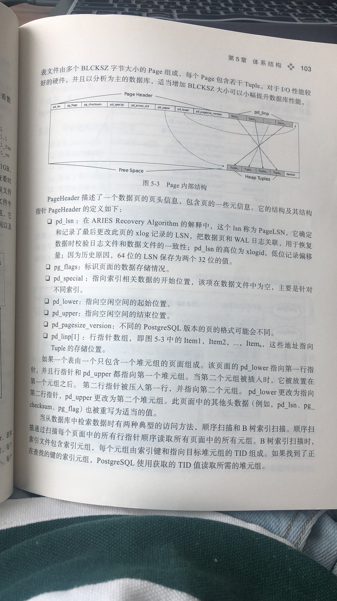
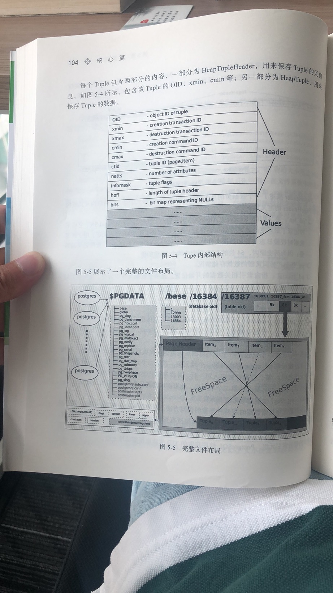
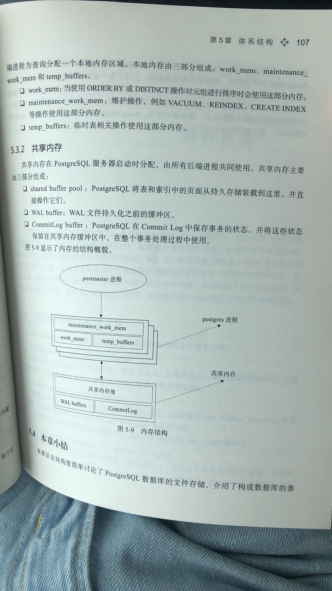

1. 安装目录各个目录介绍

   1.1 base：包含数据库用户所创建的各个数据库

   1.2 global：包含集群范围的各个表，这里有很多表以及视图来跟踪整个集群，比如pg_database

   1.3 pg_clog：包含事务提交状态数据

   1.4 pg_multixact：包含多事务状态数据（等待锁定的并发事务）

   1.5 pg_serial：包含已提交的序列化事务的有关信息

   1.6 pg_stat_tmp：包含统计子系统的临时文件

   1.7 pg_subtrans：包含子事务状态数据

   1.8 pg_tblspc：包含表空间的符号链接

   1.9 pg_twophase：包含预备事务的状态文件

   1.10 pg_xlog：包含预写日志文件

2. psql中执行**\dx**命令可以查看已经安装的contrib插件情况，查询视图**pg_available_extensions**可以列出所有可用插件

   安装删除插件使用如下命令：

   ```sql
   create extension dblink;
   drop extension dblink;
   ```

3. **pg_relation_filepath**可以查看表的数据文件路径

4. **保存点（savepoint）：**当一个事务中出现错误的时候，可以返回到savepoint的位置

   ```sql
   postgres=# begin;
   BEGIN
   postgres=*# select count(*) from t;
    count
   -------
        0
   (1 row)
   
   postgres=*# savepoint a;
   SAVEPOINT
   postgres=*# select 2 / 0;
   ERROR:  division by zero
   postgres=!# rollback to sav
   
   postgres=!# rollback to save
   
   postgres=!# rollback to savepoint a;
   ROLLBACK
   postgres=*# select 3;
    ?column?
   ----------
           3
   (1 row)
   
   postgres=*# commit;
   COMMIT
   ```

5. psql元命令介绍

   ```sql
   1. 查看数据库列表
   postgres=# \l
                                        List of databases
      Name    |   Owner    | Encoding |   Collate   |    Ctype    |     Access privileges
   -----------+------------+----------+-------------+-------------+---------------------------
    postgres  | lyndonyang | UTF8     | zh_CN.UTF-8 | zh_CN.UTF-8 |
    template0 | lyndonyang | UTF8     | zh_CN.UTF-8 | zh_CN.UTF-8 | =c/lyndonyang            +
              |            |          |             |             | lyndonyang=CTc/lyndonyang
    template1 | lyndonyang | UTF8     | zh_CN.UTF-8 | zh_CN.UTF-8 | =c/lyndonyang            +
              |            |          |             |             | lyndonyang=CTc/lyndonyang
   (3 rows)
   
   2. 查看表空间列表
   postgres=# \db
           List of tablespaces
       Name    |   Owner    | Location
   ------------+------------+----------
    pg_default | lyndonyang |
    pg_global  | lyndonyang |
   (2 rows)
   
   3. 查看schema列表
   postgres=# \dn
      List of schemas
     Name  |   Owner
   --------+------------
    public | lyndonyang
    test   | lyndonyang
   (2 rows)
   
   4. 查看所有用户\du或者\dg
   postgres=# \du
                                       List of roles
    Role name  |                         Attributes                         | Member of
   ------------+------------------------------------------------------------+-----------
    lyndonyang | Superuser, Create role, Create DB, Replication, Bypass RLS | {}
   
   postgres=# \dg
                                       List of roles
    Role name  |                         Attributes                         | Member of
   ------------+------------------------------------------------------------+-----------
    lyndonyang | Superuser, Create role, Create DB, Replication, Bypass RLS | {}
   
   5. 查看表索引占用空间
   postgres=# \dt+ t
                                       List of relations
    Schema | Name | Type  |   Owner    | Persistence | Access method |  Size   | Description
   --------+------+-------+------------+-------------+---------------+---------+-------------
    public | t    | table | lyndonyang | permanent   | heap          | 3568 kB |
   (1 row)
   
   postgres=# \di+ i1
                                           List of relations
    Schema | Name | Type  |   Owner    | Table | Persistence | Access method |  Size   | Description
   --------+------+-------+------------+-------+-------------+---------------+---------+-------------
    public | i1   | index | lyndonyang | t     | permanent   | btree         | 2208 kB |
   (1 row)
   
   6. 查看函数代码
   postgres=# \sf test
   CREATE OR REPLACE FUNCTION public.test()
    RETURNS void
    LANGUAGE sql
   AS $function$ insert into t values(100); $function$
   
   7. -E选项 获取元数据命令对应的sql语句
   lyndonyang@localhost:~$ psql -E -d postgres
   psql (15devel)
   Type "help" for help.
   
   postgres=# \dt t
   ********* QUERY **********
   SELECT n.nspname as "Schema",
     c.relname as "Name",
     CASE c.relkind WHEN 'r' THEN 'table' WHEN 'v' THEN 'view' WHEN 'm' THEN 'materialized view' WHEN 'i' THEN 'index' WHEN 'S' THEN 'sequence' WHEN 's' THEN 'special' WHEN 't' THEN 'TOAST table' WHEN 'f' THEN 'foreign table' WHEN 'p' THEN 'partitioned table' WHEN 'I' THEN 'partitioned index' END as "Type",
     pg_catalog.pg_get_userbyid(c.relowner) as "Owner"
   FROM pg_catalog.pg_class c
        LEFT JOIN pg_catalog.pg_namespace n ON n.oid = c.relnamespace
        LEFT JOIN pg_catalog.pg_am am ON am.oid = c.relam
   WHERE c.relkind IN ('r','p','t','s','')
     AND c.relname OPERATOR(pg_catalog.~) '^(t)$' COLLATE pg_catalog.default
     AND pg_catalog.pg_table_is_visible(c.oid)
   ORDER BY 1,2;
   **************************
   
            List of relations
    Schema | Name | Type  |   Owner
   --------+------+-------+------------
    public | t    | table | lyndonyang
   (1 row)
   
   8. psql -t选项只显示记录数据，而不现实schema
   lyndonyang@localhost:~$ psql -t -c "select * from t limit 1" -d postgres
     1
   
   9. 传递变量到sql
   postgres=# \set val 10
   postgres=# select * from t where c1 = :val;
    c1
   ----
    10
   (1 row)
   
   10. psql通过-v选项传递参数给数据库
   psql -v val= 10 -d postgres -f select.sql
   
   11. 查看所有支持的命令  \?
   ```

6. postgres数据文件的命名规则为：<relfilenode>.<顺序号>，文件以1G位切割点，每增加1G，生成一个新文件，后缀为_fsm和 _vm的两个文件是空闲空间映射表文件和可见性映射表文件

7. postgres数据读写以page为最小单位，page tuple的内部结构

   

   

   

8. postgres内存

   

   

9. 可以通过**pageinspect**插件查看文件的存储格式

10. postgres的共享内存由**share_buffers**控制，当收到请求的时候，服务进程会先去share_buffers查找所需数据，如果数据在共享内存，就可以直接响应客户端请求

11. 可以通过调整**work_mem**的大小来控制sort和hash切换磁盘

12. postgres物理复制核心原理是主库将预写日志WAL日志发送给备库，备库接收到WAL日志后进行重做，因此流复制是基于WAL日志文件的物理复制

13. 创建数据库的时候可以通过指定**connlimit**参数来限制可以并发连接数据库的个数

14. **json和jsonb**

    json:存储输入文本的精准存储，处理函数在每次执行时必须重新解析该数据

    jsonb:这种类型的数据被存储在一种分解好的二进制格式中，当插入这种类型的数据时要慢一些，因为需要进行附加转换，但是			jsonb类型数据的处理速度要快得多，因为不需要解析，此外jsonb类型也支持索引

15. 