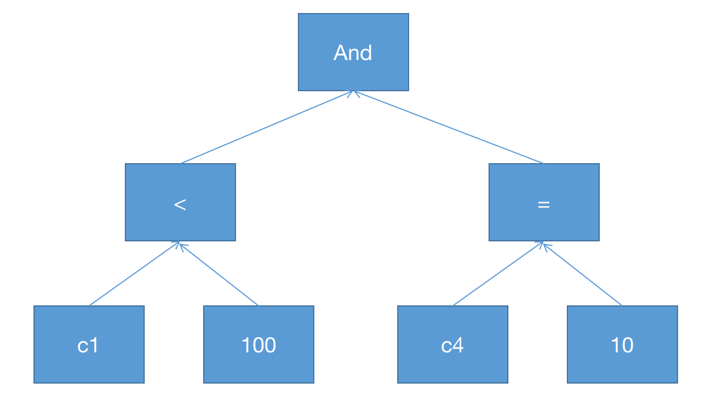

---

---

#### 经典执行器

1. SQL 中的计算主要包括两类：**expression 级别**的计算和 **operator 级别**的计算。

2. 经典的 SQL 计算引擎在 expression 层面一般采用 **expression tree** 的模型来解释执行，而在 operator 层面则大多采用**火山模型**。

   以下面这条 SQL 为例：

   ```sql
   select c1 + 100, c2 from t where c1 < 100 and c4 = 10;
   ```

   该 SQL 包含了 3 个 operator：tablescan，selection 和 projection，而每个 operator 内部又包含了各自的 expression，例如 selection 内部的 expression 为`c1 < 100 and c4 = 10`，projection 内部的 expression 则为`c1 + 100`。

   上述 SQL 中的 filter 条件对应的 expression tree 就如下图所示：

   

3. 经典 SQL 的计算引擎一个很大问题就是无论是 expression 还是 operator ，其计算的时候都大量使用到虚函数，由于每行数据都需要经过这一系列的运算，导致**计算框架开销比较大**，而且由于虚函数的大量使用，也影响了编译器的优化空间。在减小框架开销方面，两个常用的方法就是

   - 均摊开销
   - 消除开销

   **向量化执行**与**代码生成**正是数据库从业者们在这两个方向上进行的努力。

#### 向量化执行

**向量化执行的思想就是均摊开销**：假设每次通过 operator tree 生成一行结果的开销是 C 的话，经典模型的计算框架总开销就是 C * N，其中 N 为参与计算的总行数，如果把计算引擎每次生成一行数据的模型改为每次生成一批数据的话，因为每次调用的开销是相对恒定的，所以计算框架的总开销就可以减小到C * N / M，其中 M 是每批数据的行数，这样每一行的开销就减小为原来的 1 / M，当 M 比较大时，计算框架的开销就不会成为系统瓶颈了。除此之外，向量化执行还能给 compiler 带来更多的优化空间，因为引入向量化之后，实际上是将原来数据库运行时的一个大 for 循环拆成了两层 for 循环，内层的 for 循环通常会比较简单，对编译器来说也存在更大的优化可能性。

举例来说，对于一个实现两个 int 相加的 expression，在向量化之前，其实现可能是这样的：

```c++
class ExpressionIntAdd extends Expression {
        Datum eval(Row input) {
                int left = input.getInt(leftIndex);
                int right = input.getInt(rightIndex);
                return new Datum(left+right);
        }
}
```

在向量化之后，其实现可能会变为这样：

```c++
class VectorExpressionIntAdd extends VectorExpression {
        int[] eval(int[] left, int[] right) {
                int[] ret = new int[input.length];
                for(int i = 0; i < input.length; i++) {
                        ret[i] = new Datum(left[i] + right[i]);
                }
                return ret;
        }
}
```

**向量化 = 批量接口（vector） + 向量化算法 + 可选的SIMD指令应用。**

#### 代码生成思想

1. **代码生成的思想是消除开销**。代码生成可以在两个层面上进行，一个是 expression 层面，一个是 operator 层面，当然也可以同时在 expression 与 operator 层面进行代码生成。经典 SQL 计算引擎的一大缺点就是各种虚函数调用不但会带来很多额外的开销，而且还挤压了 compiler 的优化空间。代码生成可以直观的理解为在 SQL plan build 好之后，将 plan 中的代码进行一次**逻辑上的内联**。如果实现的好，代码生成能够将上述所说的火山模型代码转换为类似于手动优化的代码，显然和向量化执行一样，代码生成后的新代码也给编译器带来了更多的优化机会。与向量化执行相比，代码生成之后数据库运行时仍然是一个 for 循环，只不过这个循环内部的代码从简单的一个虚函数调用`plan.next()`展开成了一系列具体的运算逻辑，这样数据就不用再各个 operator 之间进行传递，而且有些数据还可以直接被存放在寄存器中，进一步提升系统性能。当然为了获取这些好处代码生成也付出了一定的代价，代码生成需要在 SQL 编译器编译获得 plan 之后进行额外的 code gen + jit ，对应到具体的工程实现也比向量化执行的难度要高一些。


**参考文献**

https://15721.courses.cs.cmu.edu/spring2019/papers/21-vectorization2/p2209-kersten.pdf

https://zhuanlan.zhihu.com/p/100933389

https://zhuanlan.zhihu.com/p/379977450

