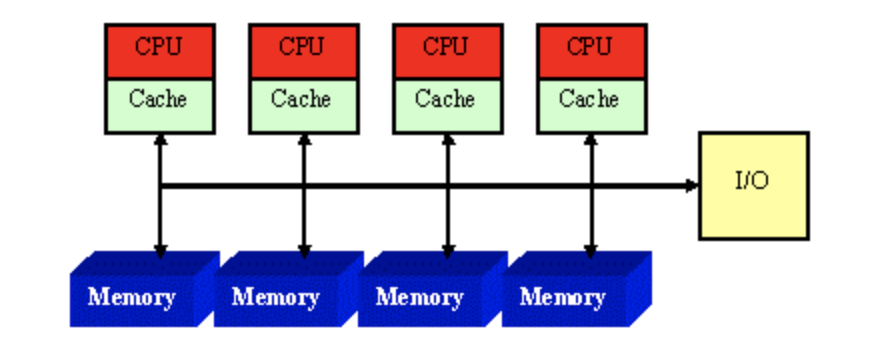

## 1. 背景知识

### 1.1 什么是NUMA？

​	NUMA（Non-Uniform Memory Access，非统一内存访问）是一种计算机内存架构，旨在解决多处理器系统中内存访问瓶颈的问题。在传统的对称多处理器（SMP）系统中，所有CPU共享同一个内存控制器和内存总线，随着CPU核心数量的增加，对共享内存的争用会变得非常严重，导致性能瓶颈。

​	NUMA架构通过将系统内存划分为多个“NUMA节点”来解决这个问题。每个NUMA节点通常包含一个或多个CPU核心以及与其直接相连的本地内存。

### 1.2 什么是内存访问模型？

- **统一内存访问（UMA）**：所有 CPU 核心访问内存的延迟和带宽相同。典型于单路或双路小型服务器。
- **非统一内存访问（NUMA）**：系统按节点划分，每个节点内存访问延迟低、带宽高；跨节点访问（远程访问）延迟高、带宽低。

### 1.3 为什么需要 NUMA？

- 当服务器拥有大量 CPU 核心时，单一内存通道带宽成为瓶颈；
- 不同核心频繁访问同一内存会形成拥塞，影响性能；
- NUMA 通过本地内存通道并行读写，提升整体带宽与可扩展性。


## 2. NUMA 架构

在一个NUMA系统中，内存不再是所有CPU核心等距离访问的统一资源。相反：

- **NUMA节点（NUMA Node）**：每个节点都包含一组CPU核心和一块本地内存。
- **本地内存（Local Memory）**：CPU访问其所在节点的内存速度最快，延迟最低。
- **远程内存（Remote Memory）**：CPU访问其他节点的内存时，需要通过高速互联总线（如Intel的QPI/UPI，AMD的Infinity Fabric）进行访问。这种访问速度会比访问本地内存慢，延迟更高。



### 对性能的影响

NUMA架构对应用程序性能有着显著影响：

- **内存访问延迟**：访问本地内存的延迟远低于访问远程内存。如果一个线程频繁访问位于另一个NUMA节点上的数据，其性能会受到严重影响。
- **内存带宽**：每个NUMA节点都有自己的内存控制器和内存总线，这增加了系统的总内存带宽。但是，如果应用程序的内存访问模式导致大量跨节点访问，那么这种带宽优势可能无法充分发挥。
- **缓存一致性**：在NUMA系统中，CPU缓存之间的数据一致性维护变得更加复杂，但现代处理器通过硬件机制（如目录式缓存协议）来保证一致性。

### 2.1 内存延迟和带宽对比

| 访问类型 | 延迟       | 带宽      |
| -------- | ---------- | --------- |
| 本地     | 50–100 ns  | 数十 GB/s |
| 远程     | 100–200 ns | 相对较低  |


## 3. NUMA感知编程

### 关键 API 概览（来自 libnuma）

| 函数                        | 功能描述                      |
| --------------------------- | ----------------------------- |
| `numa_available()`          | 检查内核是否支持 NUMA         |
| `numa_max_node()`           | 返回最大节点编号（从 0 开始） |
| `numa_alloc_onnode(size,n)` | 在节点 n 分配 size 字节内存   |
| `numa_free(ptr, size)`      | 释放之前分配的内存            |
| `numa_run_on_node(n)`       | 将当前线程绑定到节点 n        |
| `numa_set_preferred(n)`     | 设置默认内存分配节点          |

​	为了充分利用NUMA架构的优势，应用程序需要进行NUMA感知优化。这意味着程序在设计和实现时要考虑内存和线程的局部性。主要策略包括：

- **内存局部性（Memory Locality）**：尽量让数据存储在访问它的CPU核心所在的NUMA节点上。例如，如果一个线程主要处理某个数据集，那么这个数据集应该被分配到该线程所在的NUMA节点上。
- **线程亲和性（Thread Affinity）**：将线程绑定到特定的CPU核心或NUMA节点上。这确保了线程在执行时能够更频繁地访问本地内存，减少跨节点访问。
- **NUMA库支持**：操作系统通常提供专门的API或库（如Linux上的`libnuma`）来帮助开发者实现NUMA感知编程，例如：
    - `numa_alloc_onnode()`：在指定NUMA节点上分配内存。
    - `numa_set_preferred()`：设置线程偏好的NUMA节点。
    - `numa_run_on_node()`：将线程绑定到指定NUMA节点。

### 示例代码

​	接下来，模拟一个简化的数据库查询场景，并展示如何通过NUMA感知内存分配来突出其优势。

​	这个用例模拟了一个简化的数据库查询操作。创建了大量的 `DataRecord` 结构体，每个结构体代表数据库中的一行记录。多个线程并发地“查询”这些记录，查找特定值并进行一些计算。

```c++
#include <iostream>
#include <vector>
#include <thread>
#include <chrono>
#include <numeric>
#include <algorithm>

// 引入libnuma库，用于NUMA感知内存分配和线程绑定
// 在Linux上，需要安装libnuma-dev：sudo apt-get install libnuma-dev
// 编译时需要链接libnuma：g++ your_program.cpp -o your_program -lnuma -pthread
#ifdef __linux__
#include <numa.h>
#include <numaif.h>
#include <sched.h> // For sched_setaffinity
#else
// 如果不是Linux系统，提供模拟的NUMA函数，以便代码可以编译
// 但这些模拟函数不会提供真实的NUMA行为
int numa_available() { return -1; } // 模拟numa不可用
void* numa_alloc_onnode(size_t size, int node) { return malloc(size); }
void numa_free(void* start, size_t size) { free(start); }
int numa_max_node() { return 0; } // 模拟只有一个节点
int sched_setaffinity(pid_t pid, size_t cpusetsize, cpu_set_t* mask) { return 0; }
#define CPU_ZERO(mask)
#define CPU_SET(cpu, mask)
typedef struct { int __bits[1]; } cpu_set_t;
#endif

// 定义数据记录结构体，模拟数据库中的一行数据
struct DataRecord {
    long id;
    char name[64];
    double value;
    // 填充一些数据，使其大小适中
    char padding[128];
};

// 模拟数据库表中的记录数量
const size_t NUM_RECORDS_PER_NODE = 1000000; // 每个NUMA节点模拟的记录数
const int VALUE_TO_FIND = 500; // 要查找的特定值

// 线程函数：模拟数据库查询操作
// 查找特定值并计算总和
void query_worker(int thread_id, int numa_node_id, const std::vector<DataRecord*>& data_chunks, size_t start_idx, size_t end_idx, long long* result_sum) {
    // 尝试将线程绑定到指定的NUMA节点上的CPU
    // 注意：这只是一个尝试，实际绑定效果取决于系统配置和权限
    #ifdef __linux__
    if (numa_available() != -1 && numa_node_id != -1) {
        cpu_set_t cpuset;
        CPU_ZERO(&cpuset);
        // 简单地将线程绑定到与NUMA节点ID相同的CPU核心上
        // 实际应用中，需要更复杂的逻辑来确定节点上的可用CPU
        CPU_SET(numa_node_id, &cpuset); // 假设节点0对应CPU0，节点1对应CPU1等
        if (sched_setaffinity(0, sizeof(cpu_set_t), &cpuset) == 0) {
            std::cout << "线程 " << thread_id << " 成功绑定到NUMA节点 " << numa_node_id << " 上的CPU。" << std::endl;
        } else {
            std::cerr << "线程 " << thread_id << " 绑定到NUMA节点 " << numa_node_id << " 上的CPU失败。" << std::endl;
        }
    }
    #endif

    long long current_sum = 0;
    // 遍历分配给此线程的数据块
    for (size_t i = start_idx; i < end_idx; ++i) {
        // 模拟查询条件：查找特定值
        if (data_chunks[i]->value == VALUE_TO_FIND) {
            current_sum += data_chunks[i]->id;
        }
        // 模拟一些计算，增加工作量
        current_sum += data_chunks[i]->value / 2;
    }
    *result_sum = current_sum;
}

int main() {
    std::cout << "NUMA感知C++用例：模拟数据库查询性能比较" << std::endl;

    int num_numa_nodes = 1;
    #ifdef __linux__
    if (numa_available() != -1) {
        num_numa_nodes = numa_max_node() + 1;
        std::cout << "检测到 " << num_numa_nodes << " 个NUMA节点。" << std::endl;
    } else {
        std::cout << "NUMA库不可用或系统不支持NUMA。将模拟单节点行为。" << std::endl;
    }
    #endif

    // 假设我们有两个NUMA节点用于演示
    if (num_numa_nodes < 2) {
        std::cout << "为了更好地演示NUMA优势，建议在至少有两个NUMA节点的系统上运行此程序。" << std::endl;
        std::cout << "本示例将模拟两个节点，但实际性能差异可能不明显。" << std::endl;
        num_numa_nodes = 2; // 强制设置为2个节点进行模拟
    }

    std::vector<DataRecord*> all_records;
    std::vector<long long> thread_results(num_numa_nodes);

    // ----------------------------------------------------------------------
    // 场景1：NUMA感知内存分配（数据和线程在同一NUMA节点）
    // ----------------------------------------------------------------------
    std::cout << "\n--- 场景1：NUMA感知内存分配（本地访问） ---" << std::endl;
    all_records.clear();
    all_records.resize(NUM_RECORDS_PER_NODE * num_numa_nodes);

    // 为每个NUMA节点分配数据
    for (int node_id = 0; node_id < num_numa_nodes; ++node_id) {
        std::cout << "在NUMA节点 " << node_id << " 上分配 " << NUM_RECORDS_PER_NODE << " 条记录..." << std::endl;
        // 使用numa_alloc_onnode在特定NUMA节点上分配内存
        DataRecord* node_data = static_cast<DataRecord*>(numa_alloc_onnode(NUM_RECORDS_PER_NODE * sizeof(DataRecord), node_id));
        if (!node_data) {
            std::cerr << "错误：无法在NUMA节点 " << node_id << " 上分配内存！" << std::endl;
            return 1;
        }
        // 初始化数据
        for (size_t i = 0; i < NUM_RECORDS_PER_NODE; ++i) {
            node_data[i].id = i + node_id * NUM_RECORDS_PER_NODE;
            sprintf(node_data[i].name, "Record_%d_%zu", node_id, i);
            node_data[i].value = (i % 1000 == 0) ? VALUE_TO_FIND : (double)(i % 1000); // 模拟一些要查找的值
        }
        // 将分配的数据块添加到总记录列表中
        for (size_t i = 0; i < NUM_RECORDS_PER_NODE; ++i) {
            all_records[node_id * NUM_RECORDS_PER_NODE + i] = &node_data[i];
        }
    }

    auto start_time_local = std::chrono::high_resolution_clock::now();
    std::vector<std::thread> threads_local;
    for (int node_id = 0; node_id < num_numa_nodes; ++node_id) {
        // 每个线程处理其本地NUMA节点上的数据
        size_t start_idx = node_id * NUM_RECORDS_PER_NODE;
        size_t end_idx = start_idx + NUM_RECORDS_PER_NODE;
        threads_local.emplace_back(query_worker, node_id, node_id, std::ref(all_records), start_idx, end_idx, &thread_results[node_id]);
    }

    for (auto& t : threads_local) {
        t.join();
    }
    auto end_time_local = std::chrono::high_resolution_clock::now();
    std::chrono::duration<double> duration_local = end_time_local - start_time_local;
    std::cout << "场景1完成。总耗时: " << duration_local.count() << " 秒。" << std::endl;

    // 释放NUMA分配的内存
    for (int node_id = 0; node_id < num_numa_nodes; ++node_id) {
        // 只有当numa_alloc_onnode成功分配时才释放
        if (all_records[node_id * NUM_RECORDS_PER_NODE]) {
            numa_free(all_records[node_id * NUM_RECORDS_PER_NODE], NUM_RECORDS_PER_NODE * sizeof(DataRecord));
        }
    }

    // ----------------------------------------------------------------------
    // 场景2：非NUMA感知内存分配（数据和线程可能跨节点访问）
    // ----------------------------------------------------------------------
    std::cout << "\n--- 场景2：非NUMA感知内存分配（远程访问） ---" << std::endl;
    all_records.clear();
    all_records.resize(NUM_RECORDS_PER_NODE * num_numa_nodes);

    // 使用普通的malloc分配所有内存，系统可能将其分散在不同节点，或集中在一个节点
    // 这模拟了不考虑NUMA的默认内存分配行为
    std::cout << "使用普通malloc分配所有记录..." << std::endl;
    DataRecord* global_data = static_cast<DataRecord*>(malloc(NUM_RECORDS_PER_NODE * num_numa_nodes * sizeof(DataRecord)));
    if (!global_data) {
        std::cerr << "错误：无法分配全局内存！" << std::endl;
        return 1;
    }

    // 初始化数据
    for (size_t i = 0; i < NUM_RECORDS_PER_NODE * num_numa_nodes; ++i) {
        global_data[i].id = i;
        sprintf(global_data[i].name, "Global_Record_%zu", i);
        global_data[i].value = (i % 1000 == 0) ? VALUE_TO_FIND : (double)(i % 1000);
        all_records[i] = &global_data[i];
    }

    auto start_time_remote = std::chrono::high_resolution_clock::now();
    std::vector<std::thread> threads_remote;
    for (int node_id = 0; node_id < num_numa_nodes; ++node_id) {
        // 每个线程仍然绑定到其“逻辑”节点，但现在它们访问的是全局分配的内存
        // 这种情况下，很可能出现跨节点访问
        size_t start_idx = node_id * NUM_RECORDS_PER_NODE;
        size_t end_idx = start_idx + NUM_RECORDS_PER_NODE;
        threads_remote.emplace_back(query_worker, node_id + num_numa_nodes, node_id, std::ref(all_records), start_idx, end_idx, &thread_results[node_id]);
    }

    for (auto& t : threads_remote) {
        t.join();
    }
    auto end_time_remote = std::chrono::high_resolution_clock::now();
    std::chrono::duration<double> duration_remote = end_time_remote - start_time_remote;
    std::cout << "场景2完成。总耗时: " << duration_remote.count() << " 秒。" << std::endl;

    // 释放普通malloc分配的内存
    free(global_data);

    std::cout << "\n--- 性能总结 ---" << std::endl;
    std::cout << "NUMA感知内存分配（本地访问）耗时: " << duration_local.count() << " 秒。" << std::endl;
    std::cout << "非NUMA感知内存分配（远程访问）耗时: " << duration_remote.count() << " 秒。" << std::endl;

    return 0;
}
```

### 编译

```
g++ numa_example.cpp -o numa_example -lnuma -pthread -std=c++11
```

