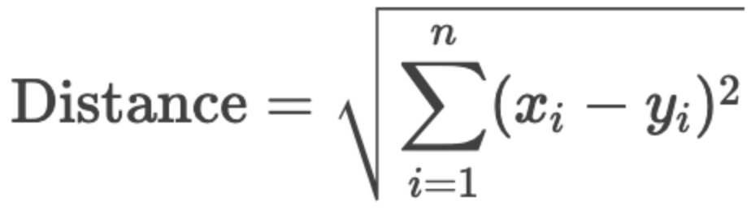
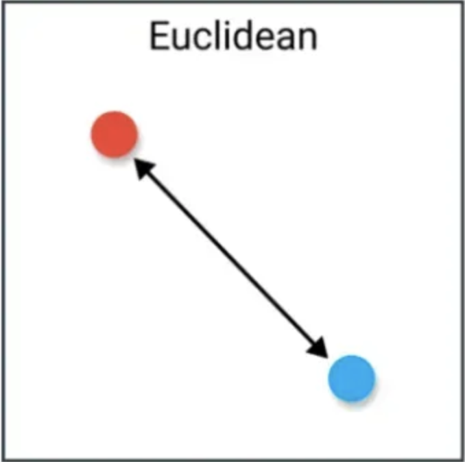
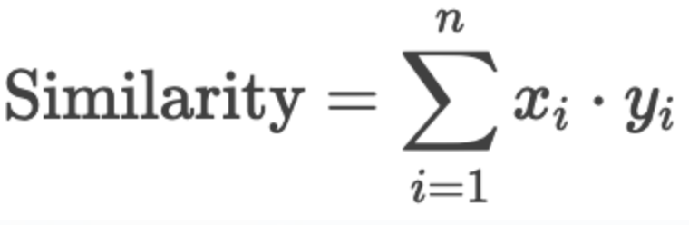
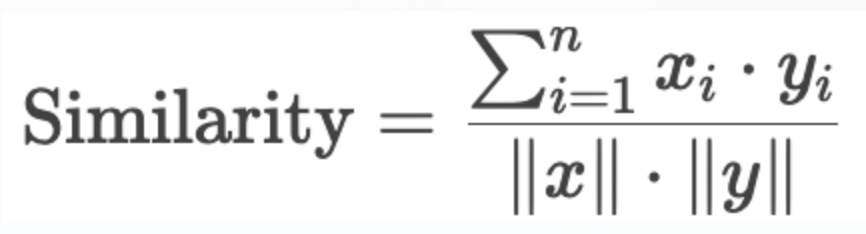
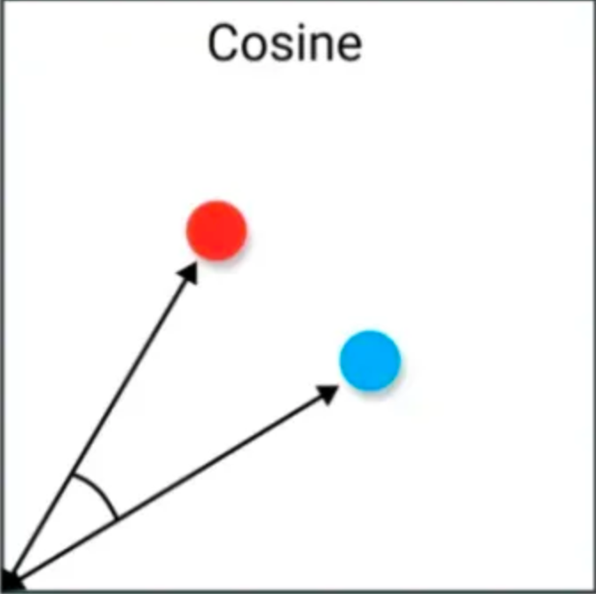
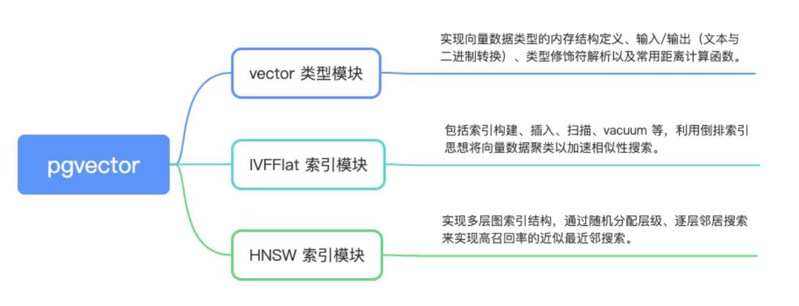

pgvector是postgresql的向量数据库插件，主要支持以下功能：

1. **存储向量数据**：使用自定义数据类型vector存储固定维度的向量 ，最大支持16000维。
2. **多种距离度量**：支持 L1（曼哈顿距离）、L2（欧氏）距离、内积（点积）和余弦相似度。
3. **索引加速**：提供 IVFFlat 和 HNSW 等近似索引，平衡查询速度和召回率。

## **向量运算符与函数**

### **运算符**

#### **曼哈顿距离（L1），运算符：<+>**

#### **欧几里得距离（L2），运算符：<->**

计算两个向量在空间中的**直线距离**：





##### **优势**

1. 物理意义明确：直接反映向量之间的几何距离，符合直觉。
2. 对全局特征敏感：适合需要精确匹配的场景（如图像像素级相似性）。
3. 与数据分布无关：无需假设向量分布，适用性广泛。

##### **劣势**

1. 对尺度敏感：如果特征维度量纲不一致，结果可能失真（需提前标准化）。
2. 高维稀疏性失效：在高维空间中，所有点距离趋于相似（“维数灾难”）。
3. 方向信息丢失：仅关注距离，忽略向量方向的关系。

##### **使用场景**

- 图像检索：比较图像像素或特征向量的绝对差异。
- 地理位置搜索：寻找物理空间中最近的点（如坐标点）。
- 数值型特征匹配：如用户行为统计向量（点击次数、时长等）。

```sql
SELECT * FROM items ORDER BY embedding <-> '[3,1,2]' LIMIT 5;
```

#### **内积（Inner Product），运算符：<#>**

注意：<#> 返回的是负内积，因此若需要实际内积值，可乘以 -1

计算两个向量的点积：



##### **优势**

1. 计算高效：无需计算平方根或归一化，运算速度最快。
2. 直接反映线性相关性：适合衡量向量间的线性组合关系。
3. 模型输出友好：某些模型（如协同过滤）直接输出内积得分。

##### **劣势**

1. 受向量长度影响大：长向量（范数大的向量）天然具有更高的内积，可能掩盖方向信息。
2. 需归一化处理：若未归一化，结果可能偏向长向量（与余弦相似度不等价）。

##### **使用场景**

- 推荐系统：用户向量与物品向量的内积直接表示预测评分（如矩阵分解）。
- 二值特征匹配：如哈希编码后的向量比较（0/1特征）。
- 加速计算场景：对计算速度要求极高时（需结合归一化预处理）。

```sql
SELECT (embedding <#> '[3,1,2]') * -1 AS inner_product FROM items;
```

#### **余弦相似度（Cosine Similarity），运算符：<=>**

若需计算余弦相似度（相似度 = 1 - 余弦距离），可以这样：

计算两个向量的夹角余弦值，忽略向量长度：





##### **优势**

1. 方向敏感性：专注向量方向而非长度，适合衡量语义相似性。
2. 高维稀疏友好：对文本、嵌入向量等稀疏数据效果极佳。
3. 尺度不变性：对向量长度不敏感，无需额外标准化。

##### **劣势**

1. 忽略向量长度信息：在需要长度信息的场景（如热度加权）中不适用。
2. 计算成本略高：需计算范数和除法，比内积稍慢。
3. 对噪声敏感：短向量（低范数）的小扰动可能导致结果剧烈变化。

##### **使用场景**

- 自然语言处理：文本嵌入向量（如BERT、Word2Vec）的语义相似性。
- 人脸识别：人脸特征向量的方向差异比长度更重要。
- 去偏差化搜索：忽略向量的绝对数值，关注相对模式（如用户兴趣偏好）。

```sql
SELECT 1 - (embedding <=> '[3,1,2]') AS cosine_similarity FROM items;
```

#### **对比总结**

| **指标**           | 欧氏距离（L2）         | 内积（Inner Product） | 余弦相似度（Cosine）         |
| ------------------ | ---------------------- | --------------------- | ---------------------------- |
| **核心关注点**     | 绝对距离               | 线性相关性            | 方向一致性                   |
| **计算复杂度**     | 高（含平方根）         | 低                    | 中（含范数计算）             |
| **是否需要归一化** | 建议归一化（消除量纲） | 可选（依场景）        | 无需归一化，公式已隐含归一化 |
| **适用数据类型**   | 稠密数值型数据         | 数值/二值型数据       | 高维稀疏数据（如文本）       |
| **典型场景**       | 图像检索、物理空间     | 推荐系统、快速匹配    | NLP、语义搜索、人脸识别      |

### **创建索引时指定距离类型**

```sql
-- 欧氏距离（默认）
CREATE INDEX ON items USING hnsw (embedding vector_l2_ops);

-- 内积（需归一化向量）
CREATE INDEX ON items USING hnsw (embedding vector_ip_ops);

-- 余弦相似度（等价于内积+归一化）
CREATE INDEX ON items USING hnsw (embedding vector_cosine_ops);
```

### **内置函数**

pgvector 还提供了一些辅助函数：

- cosine_distance(vector, vector)：计算余弦距离。
- inner_product(vector, vector)：计算内积。
- l2_distance(vector, vector)：计算欧几里得距离。
- vector_dims(vector)：返回向量维度。
- vector_norms(vector)：计算向量范数（长度）。


## **索引**

### **IVFFlat 索引**

#### **核心原理**

IVFFlat（Inverted File with Flat Compression）是一种基于**聚类分治思想**的近似最近邻（ANN）算法，其核心步骤为：

1. 聚类：使用 K-Means 等算法将所有向量划分为 lists 个聚类中心（即 Voronoi 区域）。
2. 构建倒排索引：记录每个聚类中心对应的向量列表（即属于该聚类的所有向量）。
3. 查询流程：

- - 计算查询向量与所有聚类中心的距离，选择最近的probes 个聚类。
    - 在这些聚类的向量列表中遍历，计算精确距离并返回 Top-K 结果。

#### **优势**

- 构建速度快：仅需一次聚类计算，适合数据更新频率低的场景。
- 内存占用低：仅存储聚类中心和原始向量，无额外冗余结构。
- 参数透明：通过 lists 和 probes 直观控制精度与速度的平衡。

#### **劣势**

- 查询速度较慢：需遍历多个聚类的向量列表，数据量大时延迟高。
- 静态数据友好：新增数据需定期重建索引，否则分布变化会导致精度下降。
- 精度依赖参数：probes 设置过低可能导致漏检。

#### **关键参数**

| 参数   | 说明                                               | 建议值                 |
| ------ | -------------------------------------------------- | ---------------------- |
| lists  | 聚类中心数量（决定数据分片粒度）                   | 初始设为sqrt(总行数)   |
| probes | 查询时扫描的聚类数量（值越大精度越高，但查询越慢） | 通常设为lists的 5%~10% |

#### **适用场景**

- 数据规模较小（10万 ~ 100万条）。
- 静态数据集（如历史数据归档）。
- 内存或存储资源有限（如边缘设备部署）。

```sql
-- 创建 IVFFlat 索引（以欧氏距离为例）
CREATE INDEX idx_ivfflat ON items USING ivfflat (embedding vector_l2_ops) WITH (lists = 1000);

-- 查询时动态调整 probes
SET ivfflat.probes = 20;  -- 增加扫描的聚类数
SELECT * FROM items ORDER BY embedding <-> '[0.1, ...]' LIMIT 10;
```

### **HNSW 索引**

#### **核心原理**

HNSW（Hierarchical Navigable Small World）是一种基于**多层图结构**的 ANN 算法，核心思想为：

1. 分层构建：

- - 构建多层图，上层为稀疏连接（快速导航），下层为稠密连接（精细搜索）。
    - 数据点按概率分布随机分配到不同层（高层数概率指数下降）。

1. 搜索流程：

- - 从顶层开始，找到最近的入口点。
    - 逐层向下搜索，逐步逼近目标向量。

#### **优势**

- 查询速度极快：对数级时间复杂度，适合高并发低延迟场景。
- 高召回率：通过 ef_search 参数灵活控制精度，适合对准确性要求高的场景。
- 支持增量更新：可动态插入新数据（但大量更新仍需重建索引）。

#### **劣势**

- 构建时间长：需构建多层图结构，参数 ef_construction 对时间影响大。
- 内存占用高：存储多层图的连接关系，内存消耗可达数据量的数倍。
- 参数复杂：需精细调参（如 m, ef_construction, ef_search）才能发挥最佳性能。

#### **关键参数**

| 参数            | 说明                                                     | 建议值               |
| --------------- | -------------------------------------------------------- | -------------------- |
| m               | 每层图中节点的最大连接数（影响图的密度和搜索效率）       | 16（平衡性能与精度） |
| ef_construction | 构建时的搜索深度（值越大，索引质量越高，但构建时间越长） | 100~200              |
| ef_search       | 查询时的搜索深度（值越大，召回率越高，但查询延迟增加）   | 100~300              |

#### **适用场景**

- 超大规模数据（100万条以上）。
- 高查询吞吐量（如实时推荐、人脸识别）。
- 动态数据环境（支持增量插入，但需权衡重建成本）。

```sql
-- 创建 HNSW 索引（以余弦相似度为例）
CREATE INDEX idx_hnsw ON items USING hnsw (embedding vector_cosine_ops) WITH (m = 16, ef_construction = 128);

-- 查询时动态调整 ef_search
SET hnsw.ef_search = 200;  -- 提升召回率
SELECT * FROM items ORDER BY embedding <=> '[0.1, ...]' LIMIT 10;
```

### **核心对比**

| **指标**         | **IVFFlat**                | **HNSW**                              |
| ---------------- | -------------------------- | ------------------------------------- |
| **适用数据规模** | 中小规模（10万 ~ 100万条） | 大规模（100万条以上）                 |
| **构建速度**     | **快**（分钟级）           | **慢**（小时级，依赖ef_construction） |
| **查询速度**     | 较慢（需扫描多个聚类中心） | **极快**（对数级时间复杂度）          |
| **内存占用**     | 低（仅存储聚类中心）       | 高（存储多层图结构）                  |
| **存储占用**     | 低（紧凑存储）             | 高（冗余边信息）                      |
| **更新支持**     | 差（数据变更需重建索引）   | 一般（支持增量更新，但构建成本高）    |
| **准确性**       | 依赖lists和probes参数      | 依赖ef_search参数，通常更高           |
| **适用场景**     | 静态数据集、资源有限环境   | 动态数据、高查询吞吐、低延迟需求      |


## **主要代码模块**

