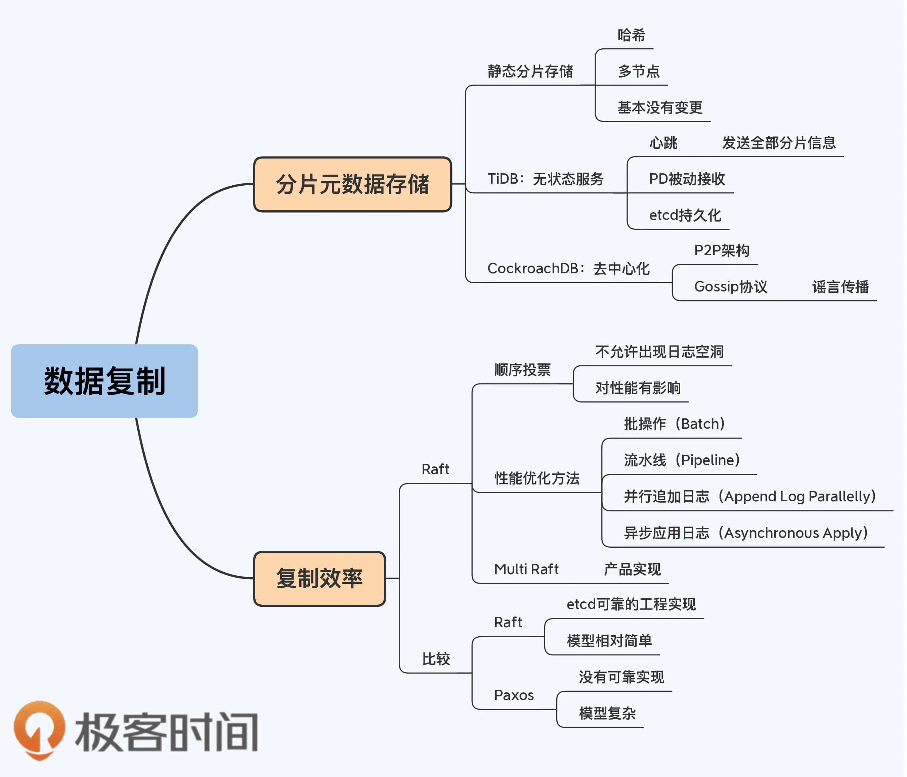

#### Raft 的性能缺陷

复制效率上 Raft 会差一些，主要原因就是 Raft 必须“顺序投票”，不允许日志中出现空洞。

**一个完整的 Raft 日志复制过程（单个事务）：**

（1）Leader 收到客户端的请求。

（2）Leader 将请求内容（即 Log Entry）追加（Append）到本地的 Log。

（3）Leader 将 Log Entry 发送给其他的 Follower。

（4）Leader 等待 Follower 的结果，如果大多数节点提交了这个 Log，那么这个 Log Entry 就是 Committed Entry，Leader 就可以将它应用（Apply）到本地的状态机。

（5）Leader 返回客户端提交成功。

（6）Leader 继续处理下一次请求。

**Raft 的性能优化方法（TiDB）：**Raft 的优化方法，大的思路就是并行和异步化

（1）**批操作（Batch）**。Leader 缓存多个客户端请求，然后将这一批日志批量发送给 Follower。Batch 的好处是减少的通讯成本。

（2）**流水线（Pipeline）**。Leader 本地增加一个变量（称为 NextIndex），每次发送一个 Batch 后，更新 NextIndex 记录下一个 Batch 的位置，然后不等待 Follower 返回，马上发送下一个 Batch。如果网络出现问题，Leader 重新调整 NextIndex，再次发送 Batch。当然，这个优化策略的前提是网络基本稳定。

（3）**并行追加日志（Append Log Parallelly）**。Leader 将 Batch 发送给 Follower 的同时，并发执行本地的 Append 操作。因为 Append 是磁盘操作，开销相对较大，而标准流程中 Follower 与 Leader 的 Append 是先后执行的，当然耗时更长。改为并行就可以减少部分开销。当然，这时 Committed Entry 的判断规则也要调整。在并行操作下，即使 Leader 没有 Append 成功，只要有半数以上的 Follower 节点 Append 成功，那就依然可以视为一个 Committed Entry，Entry 可以被 Apply。

（4）**异步应用日志（Asynchronous Apply）**。Apply 并不是提交成功的必要条件，任何处于 Committed 状态的 Log Entry 都确保是不会丢失的。Apply 仅仅是为了保证状态能够在下次被正确地读取到，但多数情况下，提交的数据不会马上就被读取。因此，Apply 是可以转为异步执行的，同时读操作配合改造。

TIDB和CockroachDB 都借鉴了etcd的设计，etcd 是单 Raft 组，写入性能受限。所以，TiDB 和 CockroachDB 都改造成多个 Raft 组，这个设计被称为 Multi Raft，所有采用 Raft 协议的分布式数据库都是 **Multi Raft**。这种设计，可以让多组并行，一定程度上规避了 Raft 的性能缺陷。

