### 执行器模型

**openGauss中有两种执行器模型，火山模型和向量化模型(列存)**

**openGauss的执行器做得优化：向量化，JIT(codegen)，SQL By Pass，执行器算子级并行，scan预取（beta功能，暂时未打开）**

#### 迭代模型（火山模型）

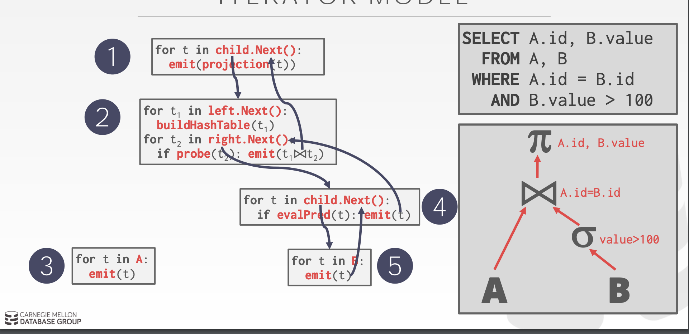

​	火山模型是一种经典的基于行的流式迭代模型，例如Oracle，SQL Server，MySQL，postgresql，Greenplum，doris等都是使用的该模式。

​	火山模型模型中，所有的运算符(operator)都被看成是一个迭代器，它们都提供一组简单的接口：init/open()—next()—end/close()，查询计划树由一个个这样的关系运算符组成，每一次的next()调用，运算符就返回一行(Row)，数据通过运算符自上而下的next()嵌套调用而被动的进行拉取。

​	火山模型中每一个运算符都将下层的输入看成是一张表，next()接口的一次调用就获取表中的一行数据。

​	**火山模型的优点**：简单，处理逻辑清晰，每个 Operator 只需要关心自己的处理逻辑，耦合性很低。

​	**火山模型的缺点**：查询树调用next()接口次数太多，一次只取一条数据，不利于CPU Cache发挥作用；而且 Joins, Subqueries, Order By 等操作经常会阻塞。

#### 向量化模型

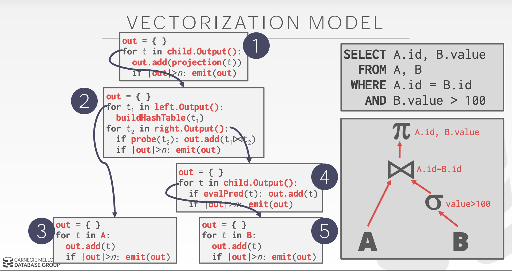

​	向量化模型是在火山模型上做的改进，clickhouse，duckdb，tidb，presto，vectorwise(monetdb改进版)，snowflake，redshift等都是采用的该模式。

​	**向量化执行**是由火山模型每次一条tuple变成一组tuples，这样最为直观的观察就是从上层节点向下层节点的调用次数少了。相应的CPU的利用率得到了提高，另外数据被组织在一起。可以利用硬件发展带来的一些收益；如SIMD。

### 执行流程

​	所有的SQL语句的执行都必须从一个Portal开始，所有的Portal流程都必须要进过下面这个流程：

​	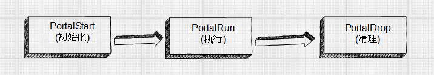

​	该流程都在exec_simple_query函数内部进行。过程大致如下：

​		1)  调用函数CreatePortal创建一个Portal，它的内存上下文，资源跟踪器等都已经设置好，但是sourceText,stmts字段还未设置；

​		2)  调用函数PortalDefineQuery函数为刚刚创建的Portal设置sourceText，stmt等，并且设置Portal的状态为PORTAL_DEFINED;

​		3)  调用函数PortalStart对定义好的Portal进行初始化：

​			 a. 调用函数ChoosePortalStrategy为portal选择策略； 

```c
typedef enum PortalStrategy {
	PORTAL_ONE_SELECT,     // 处理单个的SELECT语句，调用Executor模块；
	PORTAL_ONE_RETURNING,  // 处理带RETURNING的UPDATE/DELETE/INSERT语句，调用Executor模块；
	PORTAL_ONE_MOD_WITH,   // 处理带有INSERT/UPDATE/DELETE的WITH子句的SELECT，其处理逻辑类似PORTAL_ONE_RETURNING。调用Executor模块；
	PORTAL_UTIL_SELECT,    // 处理单个的数据定义语句，调用ProcessUtility模块；
	PORTAL_MULTI_QUERY  // 是前面几种策略的混合，可以处理多个原子操作。  例如： insert into t1 select c1 from t;
} PortalStrategy;
```
​			 b. 如果选择的是PORTAL_ONE_SELECT，则调用CreateQueryDesc为Portal创建查询描述符； 

​			 c. 如果选择的是PORTAL_ONE_RETURNING或者PORTAL_ONE_MOD_WITH，则调用ExecCleanTypeFromTL为portal创建返回元组的描述符； 

​			 d. 对于PORTAL_UTIL_SELECT则调用UtilityTupleDescriptor为Portal创建查询描述符； 

​			 e. 对于PORTAL_MULTI_QUERY这里则不做过多操作；

​			 f. 将Portal的状态设置为PORTAL_READY。

​		4）调用函数PortalRun执行portal，这就按照既定的策略调用相关执行部件执行Portal；

​		5）调用函数PortalDrop清理portal，释放资源。

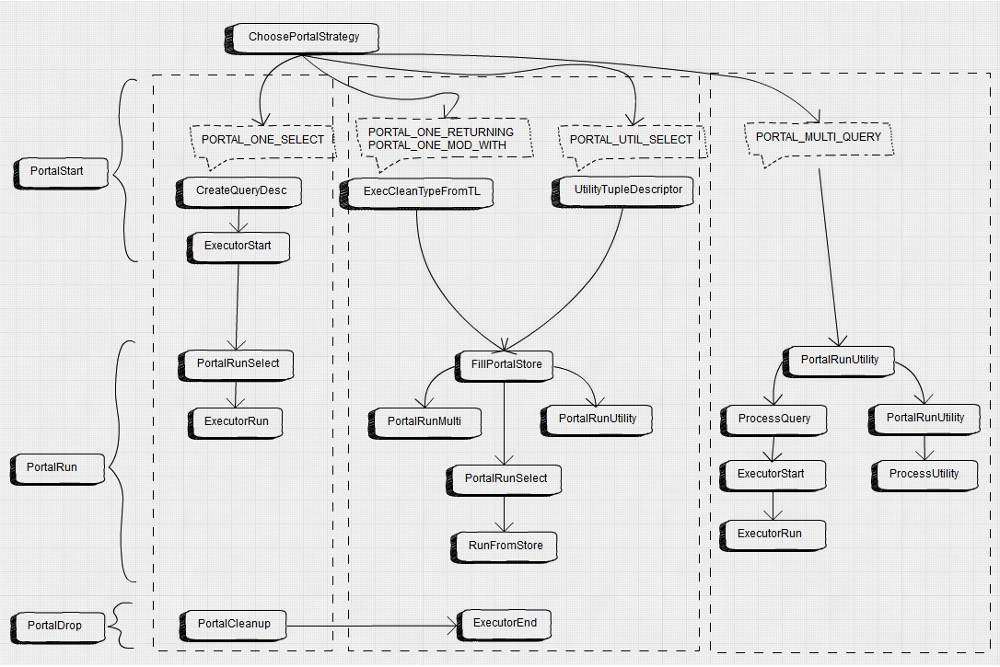

#### Utility流程

​	**不需要经过优化器处理产生查询计划树**

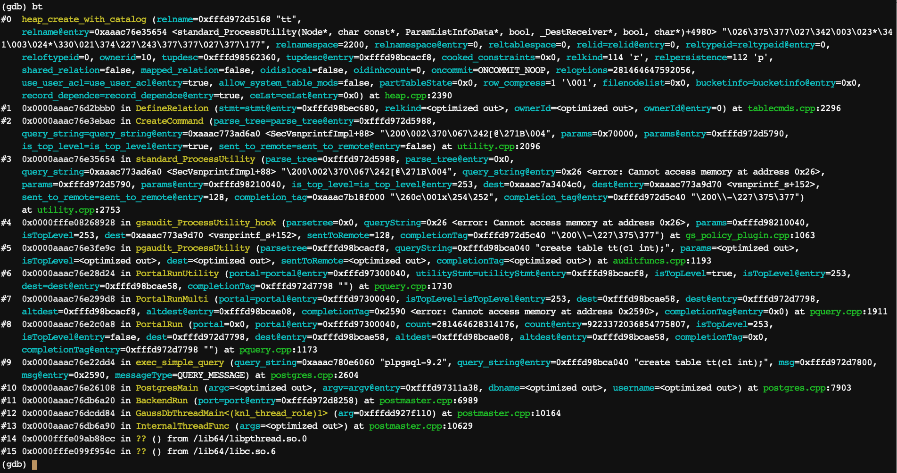

**主要的功能处理函数**

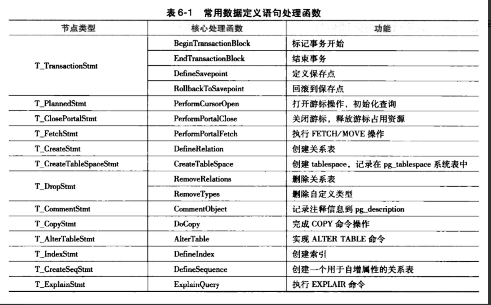

#### 正常优化器流程

​	**整个执行流程图**

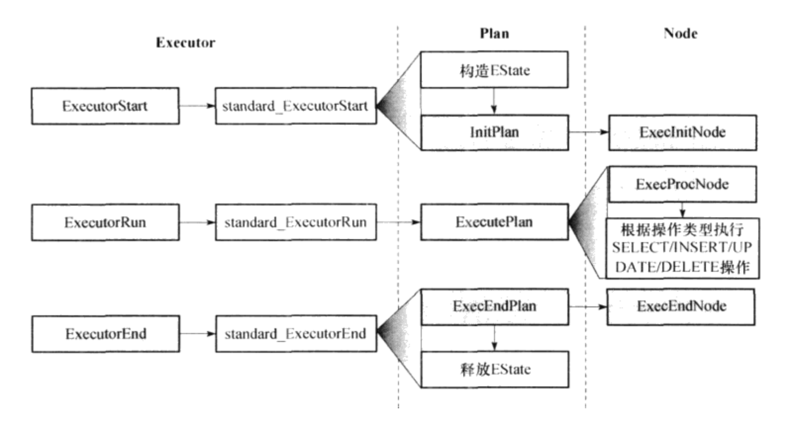

**ExecutorStart调用栈**

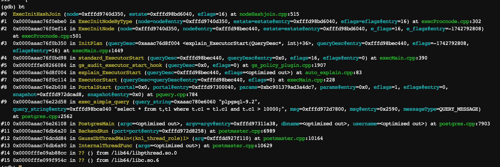

**ExecutorRun调用栈**

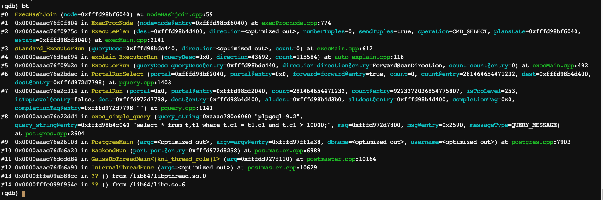

**ExectorEnd调用栈**

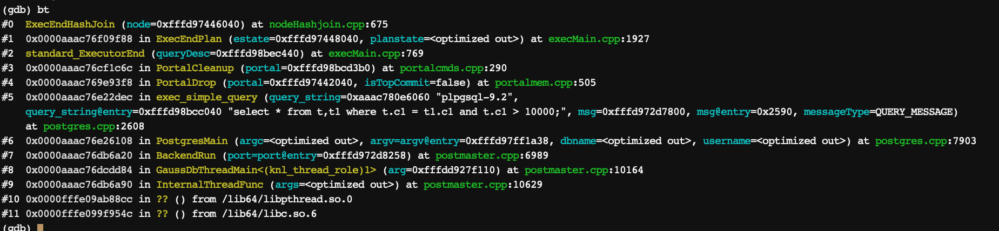

**算子并行化执行流程**

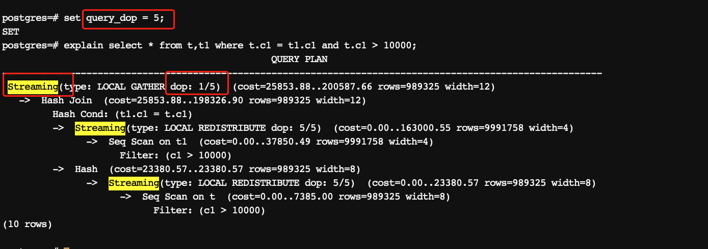

**并行化算子ExecutorStart**


**并行化算子ExecuteRun**

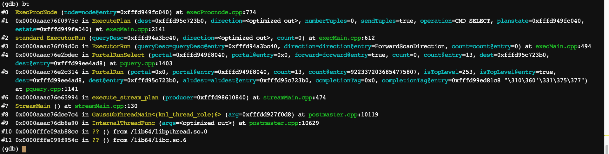

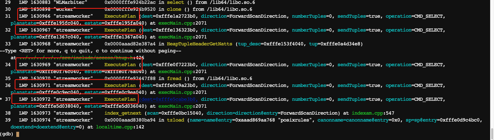

**并行化算子ExecutorEnd**

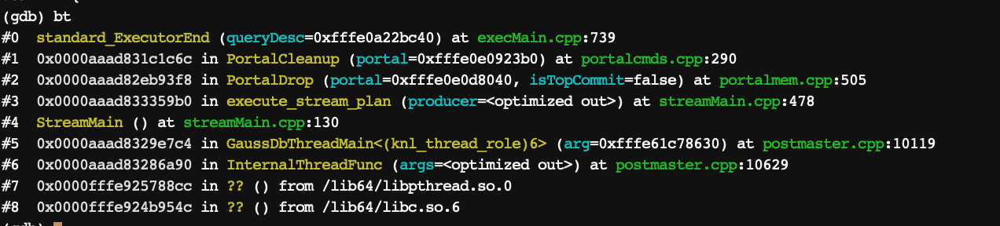

