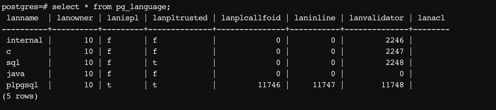
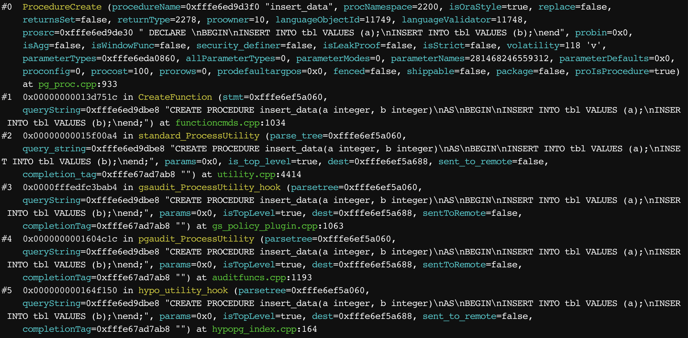
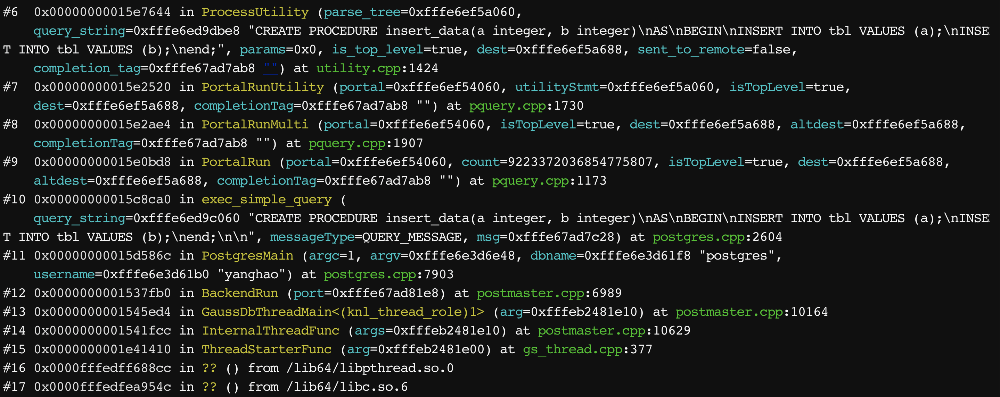
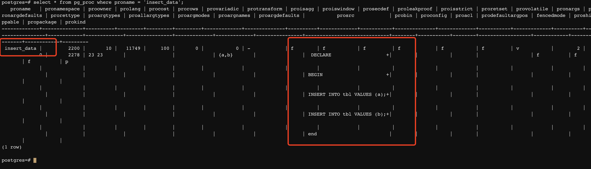
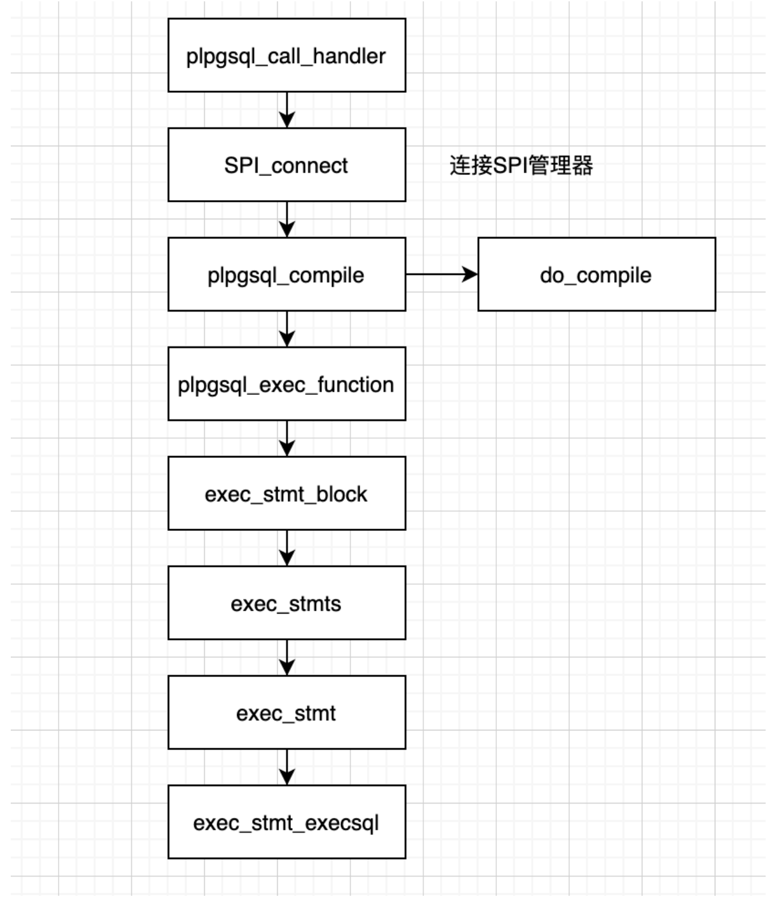

### 用户自定义函数和存储过程

```sql
CreateFunctionStmt:
			CREATE opt_or_replace FUNCTION func_name_opt_arg proc_args
			RETURNS func_return createfunc_opt_list opt_definition
				{
					CreateFunctionStmt *n = makeNode(CreateFunctionStmt);
					n->isOraStyle = false;
					n->replace = $2;
					n->funcname = $4;
					n->parameters = $5;
					n->returnType = $7;
					n->options = $8;
					n->withClause = $9; 
					n->isProcedure = false;
					$$ = (Node *)n;
				}
				
CreateProcedureStmt:
			CREATE opt_or_replace PROCEDURE func_name_opt_arg proc_args
			opt_createproc_opt_list as_is {u_sess->parser_cxt.eaten_declare = false; u_sess->parser_cxt.eaten_begin = false;} subprogram_body
				{
					CreateFunctionStmt *n = makeNode(CreateFunctionStmt);
					int count = get_outarg_num($5);
					n->isOraStyle = true;
					n->replace = $2;
					n->funcname = $4;
					n->parameters = $5;
					n->returnType = NULL;
					n->isProcedure = true;
					if (0 == count)
					{
						n->returnType = makeTypeName("void");   
						n->returnType->typmods = NULL;
						n->returnType->arrayBounds = NULL;
					}
					n->options = $6;
					n->options = lappend(n->options, makeDefElem("as",
										(Node *)list_make1(makeString($9))));
					n->options = lappend(n->options, makeDefElem("language",
										(Node *)makeString("plpgsql")));
					n->withClause = NIL;
					$$ = (Node *)n;
				}
```

```c
typedef struct CreateFunctionStmt {
    NodeTag type;
    bool isOraStyle;      /* T => a db compatible function or procedure */
    bool replace;         /* T => replace if already exists */
    List* funcname;       /* qualified name of function to create */
    List* parameters;     /* a list of FunctionParameter */
    TypeName* returnType; /* the return type */
    List* options;        /* a list of DefElem */
    List* withClause;     /* a list of DefElem */
    bool isProcedure;     /* true if it is a procedure */
} CreateFunctionStmt;

isOraStyle表示是否是oracle兼容模式，为true的时候，表示兼容oracle的过程语法
withClause选项，存储过程不支持with格式的语法，函数支持，该选项有两个值
isStrict，Equivalent to STRICT or RETURNS NULL ON NULL INPUT.
isCachable，is an obsolete equivalent of IMMUTABLE.

https://opengauss.org/zh/docs/1.0.0/docs/Developerguide/CREATE-FUNCTION.html
https://www.postgresql.org/docs/9.1/sql-createfunction.html
```

### 存储过程和自定义函数的区别

1. 函数有返回值，而过程执行执行命令
2. 过程只支持plpgsql

### 为什么需要**UDF**/存储过程？

1. 减少应⽤和服务端的通信开销，复杂的UDF中可以包含⼏⼗甚⾄⼏百条语句，如果不使⽤UDF，应⽤

   就需要将每条语句都发送到服务端，增加通信开销，UDF可以降低这个开销

2. 同⼀套业务逻辑可以被不同的应⽤使⽤，UDF可以保证不同应⽤程序使⽤的⼀致性

3. 保护元数据信息，使⽤UDF，不会将数据库表结构暴露给应⽤程序

4. 将业务与应⽤解耦，业务需求更新时，只需要修改UDF定义，⽽不需要修改应⽤程序

5.  有时候⽤户想要得到的结果可能没有办法直接使⽤数据库提供的内置函数来表示，这个时候就可以⽤UDF来⾃定义⼀些函数

### **UDF**有什么劣势？

1. 不便于调试，尤其在性能调优的场景，单独⼀条query可以拿出来做explain analyze操作，但使⽤

   UDF⽆法查看其内部的执⾏计划(pg的新版本通过**auto explain**插件解决了这个问题，高斯这个功能没打开，这个功能类似在外层hook了一段执行器代码，高斯重构后，这块逻辑没改，所以现在不能用

2. 不便于移植，对于⼤部分的SQL标准，换其它数据库不影响程序的使⽤，但不同数据库的UDF定义⽅式不同

### 内置语言有哪些？



### **create function**发⽣了什么？





**CreateFunction**前⾯的部分会做⼀些合法性检查，之后解析出后⾯调⽤所需的结构。

**ProcedureCreate**主要⼯作就是将**CreateFunction**传过来得参数做调整，之后组成**tuple**将信息保存到**pg_proc**表中，供后⾯调⽤**function**的时候查询。

创建成功后就可以在pg_proc表中查到这个过程或者函数的信息。



### **function**执⾏流程

```c
(gdb) bt
#0  plpgsql_compile (fcinfo=0xfffdbdde28a8, for_validator=false) at pl_comp.cpp:113
#1  0x0000000001e4e7c8 in plpgsql_call_handler (fcinfo=0xfffdbdde28a8) at pl_handler.cpp:221
#2  0x000000000170d468 in ExecMakeFunctionResultNoSets<false, false> (fcache=0xfffdbdde2760, econtext=0xfffdbdde2188,
    isNull=0xfffdbdde2ff0, isDone=0xfffdbdde3258) at execQual.cpp:2166
#3  0x00000000016fa060 in ExecEvalFunc (fcache=0xfffdbdde2760, econtext=0xfffdbdde2188, isNull=0xfffdbdde2ff0,
    isDone=0xfffdbdde3258) at execQual.cpp:2783
#4  0x0000000001702da0 in ExecTargetList (targetlist=0xfffdbdde31f0, econtext=0xfffdbdde2188, values=0xfffdbdde2fa8,
    isnull=0xfffdbdde2ff0, itemIsDone=0xfffdbdde3258, isDone=0xfffdbf16738c) at execQual.cpp:5581
#5  0x000000000170354c in ExecProject (projInfo=0xfffdbdde3038, isDone=0xfffdbf16738c) at execQual.cpp:5770
#6  0x0000000001762a44 in ExecResult (node=0xfffdbdde2060) at nodeResult.cpp:149
#7  0x00000000016f31f8 in ExecProcNodeByType (node=0xfffdbdde2060) at execProcnode.cpp:609
#8  0x00000000016f3830 in ExecProcNode (node=0xfffdbdde2060) at execProcnode.cpp:774
#9  0x00000000016edec8 in ExecutePlan (estate=0xfffdbdd56060, planstate=0xfffdbdde2060, operation=CMD_SELECT, sendTuples=true,
    numberTuples=0, direction=ForwardScanDirection, dest=0xfffdbdcfda80) at execMain.cpp:2141
#10 0x00000000016ea29c in standard_ExecutorRun (queryDesc=0xfffdbdd0d060, direction=ForwardScanDirection, count=0)
    at execMain.cpp:612
#11 0x00000000014e644c in explain_ExecutorRun (queryDesc=0xfffdbdd0d060, direction=ForwardScanDirection, count=0)
    at auto_explain.cpp:116
#12 0x00000000016e9d1c in ExecutorRun (queryDesc=0xfffdbdd0d060, direction=ForwardScanDirection, count=0) at execMain.cpp:492
#13 0x00000000015e1924 in PortalRunSelect (portal=0xfffdbdd66060, forward=true, count=0, dest=0xfffdbdcfda80)
    at pquery.cpp:1403
#14 0x00000000015e08d8 in PortalRun (portal=0xfffdbdd66060, count=9223372036854775807, isTopLevel=true, dest=0xfffdbdcfda80,
    altdest=0xfffdbdcfda80, completionTag=0xfffdbf167ab8 "") at pquery.cpp:1141
#15 0x00000000015c8ca0 in exec_simple_query (query_string=0xfffdbdcfc060 "select add(1, 2);", messageType=QUERY_MESSAGE,
    msg=0xfffdbf167c28) at postgres.cpp:2604
#16 0x00000000015d586c in PostgresMain (argc=1, argv=0xfffdbd1d6e48, dbname=0xfffdbd1d61f8 "postgres",
--Type <RET> for more, q to quit, c to continue without paging--
    username=0xfffdbd1d61b0 "yanghao") at postgres.cpp:7903
#17 0x0000000001537fb0 in BackendRun (port=0xfffdbf1681e8) at postmaster.cpp:6989
#18 0x0000000001545ed4 in GaussDbThreadMain<(knl_thread_role)1> (arg=0xfffe01281dd8) at postmaster.cpp:10164
#19 0x0000000001541fcc in InternalThreadFunc (args=0xfffe01281dd8) at postmaster.cpp:10629
#20 0x0000000001e41410 in ThreadStarterFunc (arg=0xfffe01281dc8) at gs_thread.cpp:377
#21 0x0000fffe2ec988cc in ?? () from /lib64/libpthread.so.0
#22 0x0000fffe2ebd954c in ?? () from /lib64/libc.so.6
```

### 调用流程图



​	**pl**写了⼀套属于⾃⼰的词法语法分析，针对**function**的**body**部分做了⼀次解析，而且会缓存做过**compile**的**function**，**compile**前会⾸先**check**缓存中是否存在，如果存在就不需要重新做⼀次，因为这是⼀个相对⽐较**重**的操作

​	**exec_stmt**是真正执⾏的部分，会根据⾥⾯每条**statement**的类型，分类处理，这时候就需要和**spi**交互，利⽤**spi**调⽤**执行器**的功能

```c
/* ----------
 * Execution tree node types
 * ----------
 */
enum PLpgSQL_stmt_types {
    PLPGSQL_STMT_BLOCK,   /* ⼦block,每个begin end相当于⼀个block, block可以套block*/
    PLPGSQL_STMT_ASSIGN,
    PLPGSQL_STMT_IF,
    PLPGSQL_STMT_GOTO,
    PLPGSQL_STMT_CASE,
    PLPGSQL_STMT_LOOP,
    PLPGSQL_STMT_WHILE,
    PLPGSQL_STMT_FORI,
    PLPGSQL_STMT_FORS,
    PLPGSQL_STMT_FORC,
    PLPGSQL_STMT_FOREACH_A,
    PLPGSQL_STMT_EXIT,
    PLPGSQL_STMT_RETURN,
    PLPGSQL_STMT_RETURN_NEXT,
    PLPGSQL_STMT_RETURN_QUERY,
    PLPGSQL_STMT_RAISE,
    PLPGSQL_STMT_EXECSQL,
    PLPGSQL_STMT_DYNEXECUTE,
    PLPGSQL_STMT_DYNFORS,
    PLPGSQL_STMT_GETDIAG,
    PLPGSQL_STMT_OPEN,
    PLPGSQL_STMT_FETCH,
    PLPGSQL_STMT_CLOSE,
    PLPGSQL_STMT_PERFORM,
    PLPGSQL_STMT_COMMIT,
    PLPGSQL_STMT_ROLLBACK,
    PLPGSQL_STMT_NULL
};
```


​	**SPI_execute_plan**基本就是调用执行器的流程，start--->run--->finish--->end来执行function中每条语句