#### 											以下笔记来自极客时间课程《分布式数据库30讲》

**课程链接**：https://time.geekbang.org/column/intro/331?utm_source=time_web&utm_medium=menu&utm_term=timewebmenu

#### 开篇

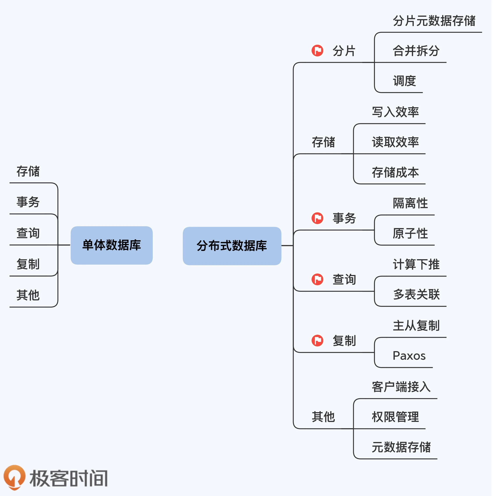

#### 第一讲

1. 恢复时间目标（Recovery Time Objective, **RTO**）和恢复点目标（Recovery Point Objective, **RPO**）。

   RTO 是指故障恢复所花费的时间，可以等同于可靠性；RPO 则是指恢复服务后丢失数据的数量。数据库高可靠意味着 RPO 等于 0，RTO 小于 5 分钟。

#### 第二三讲

1. 分布式数据库的一致性，其实是**数据一致性**和**事务一致性**两个方面。

   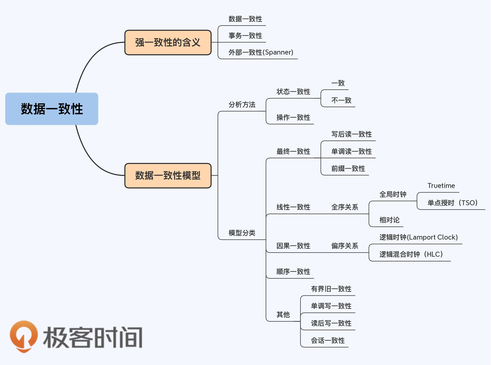

   

2. CAP的C是多副本、单操作的数据一致性；而ACID的C是单副本、多操作的事务一致性。

3. **BASE**：BA 表示基本可用性（Basically Available），S 表示软状态（Soft State），E 表示最终一致性（Eventual Consistency）。

4. **ACID**:

   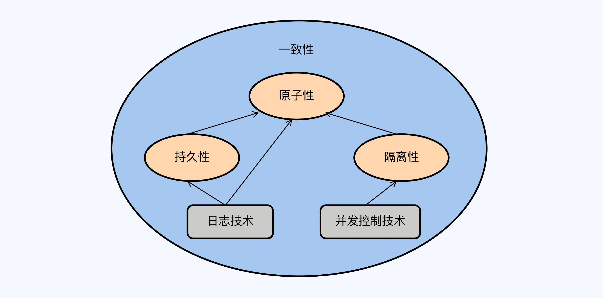

   ​	**一致性**，可以看作是对 “事务”整体目标的阐述，并没有提出任何具体的功能需求，所以在数据库中也很难找到针对性的设计。

   ​	**持久性**，核心思想就是要应对系统故障。可以把故障分为两种：

   ​	（1）存储硬件无损、可恢复的故障。这种情况下，主要依托于**预写日志（Write Ahead Log, WAL）**保证第一时间存储数据。WAL 采用顺序写入的方式，可以保证数据库的低延时响应。

   ​	（2）存储硬件损坏、不可恢复的故障。这种情况下，需要用到**日志复制技术**，将本地日志及时同步到其他节点。实现方式大体有三种：第一种是单体数据库自带的同步或半同步的方式，其中半同步方式具有一定的容错能力，实践中被更多采用；第二种是将日志存储到共享存储系统上，后者会通过冗余存储保证日志的安全性，亚马逊的 Aurora 采用了这种方式，也被称为 Share Storage；第三种是基于 Paxos/Raft 的共识算法同步日志数据，在分布式数据库中被广泛使用。无论采用哪种方式，目的都是保证在本地节点之外，至少有一份完整的日志可用于数据恢复。

5. **SQL-92：隔离级别**

   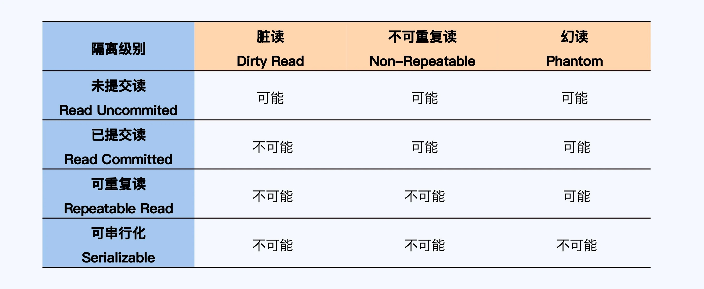

   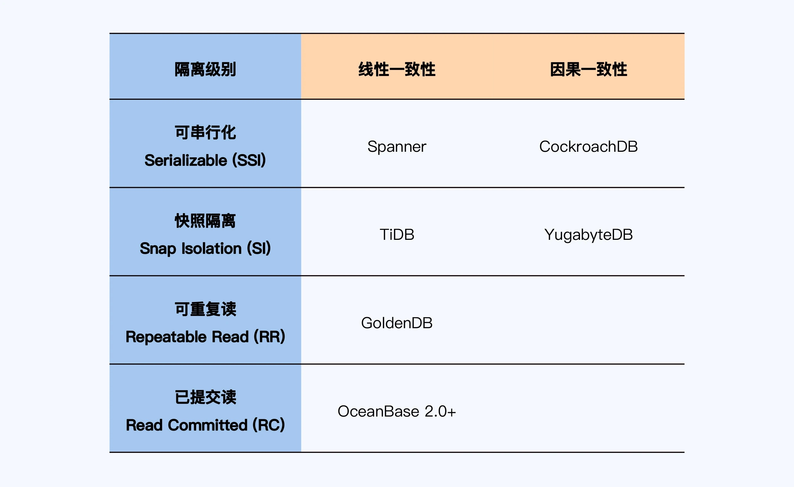

   

   ​	**数据一致性**关注的是单对象、单操作在多副本上的一致性，**事务一致性**则是关注多对象、多操作在单副本上的一致性，分布式数据库的一致性是数据一致性与事务一致性的融合。

#### 第四讲

1. 数据库基本架构

   

2. **PGXC 架构**是从分库分表方案演进而来的。它设置了协调节点，在代理功能的基础上增加了分布式事务管理、跨节点查询功能；原有的单体数据继续作为数据节点；新增了全局时钟和分片信息管理两个功能，这两个功能又有两种实现情况，一是拆分为两个独立角色节点，例如 GoldenDB，二是合并为一个角色节点，例如 TBase。

   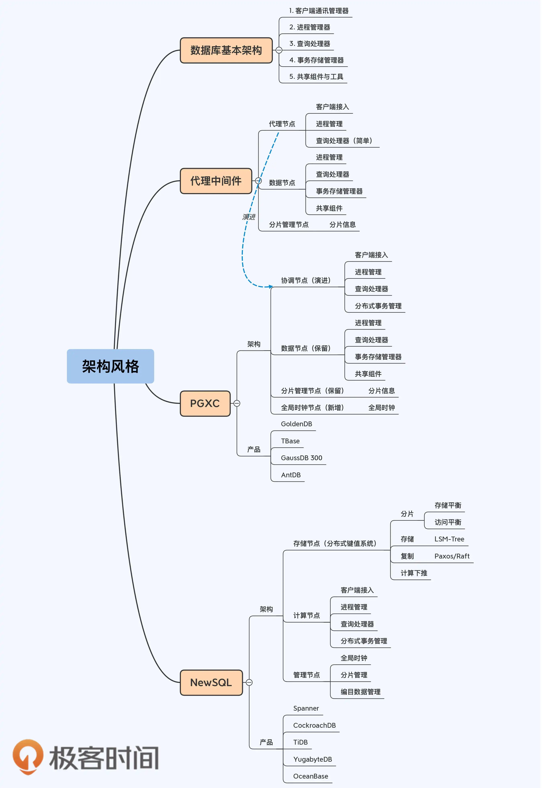

   **本节论文参考：**

   https://dsf.berkeley.edu/papers/fntdb07-architecture.pdf

   

#### 第五讲

1. **常见授时方案**		

   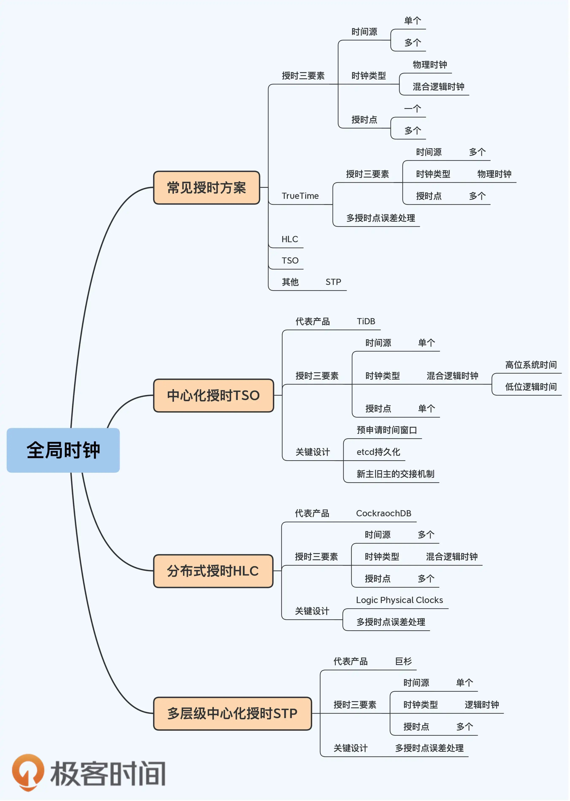

   **本节论文参考**

   ​	https://www.cs.princeton.edu/courses/archive/fall10/cos597B/papers/percolator-osdi10.pdf

   ​	https://cse.buffalo.edu/~demirbas/publications/hlc.pdf

   

#### 第六讲

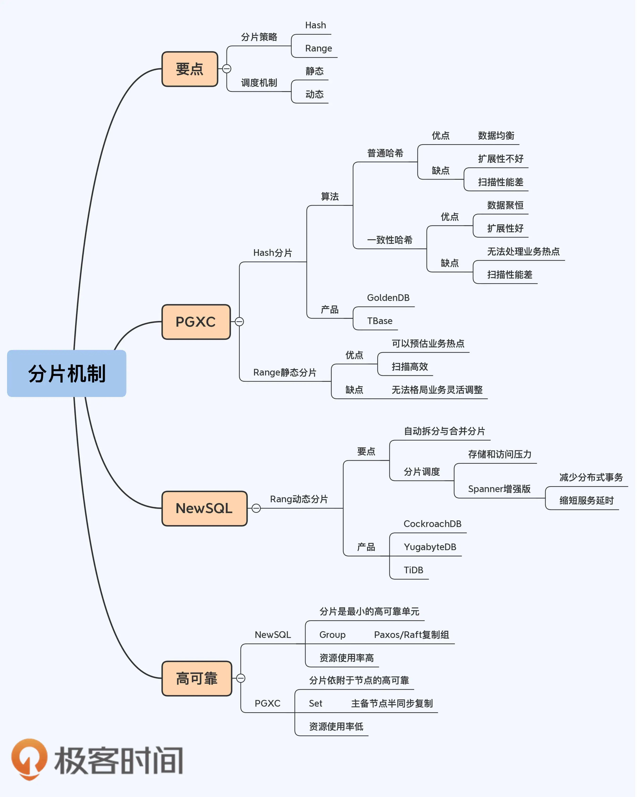

**本节论文参考：**

http://cs.brown.edu/courses/cs296-2/papers/consistent.pdf

https://www2.cs.duke.edu/courses/cps399.28/spring08/papers/osdi06-ChangDeanEtAl-bigtable.pdf

https://www.cs.princeton.edu/courses/archive/fall13/cos518/papers/spanner.pdf

#### 第七讲

1. **元数据设计**

   **TiDB：无服务状态**，元数据由 Placement Driver 节点管理。Placement Driver 这个名称来自 Spanner 中对应节点角色，简称为 PD。

   虽然无状态服务有很大的优势，但 PD 仍然是一个单点，也就是说这个方案还是一个中心化的设计思路，可能存在性能方面的问题。

   **CockroachDB：去中心化**，CockroachDB 的解决方案是使用 **Gossip 协议**。CockroachDB 采用了 P2P 架构，每个节点都要保存完整的元数据，这样节点规模就非常大，当然也就不适用广播机制。

   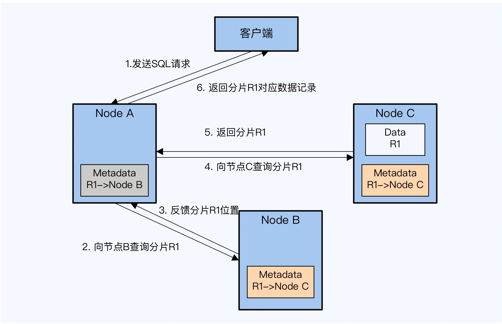

   (1) 节点 A 接到客户端的 SQL 请求，要查询数据表 T1 的记录，根据主键范围确定记录可能在分片 R1 上，而本地元数据显示 R1 存储在节点 B 上。

   (2) 节点 A 向节点 B 发送请求。很不幸，节点 A 的元数据已经过时，R1 已经重新分配到节点 C。

   (3) 此时节点 B 会回复给节点 A 一个非常重要的信息，R1 存储在节点 C。

   (4) 节点 A 得到该信息后，向节点 C 再次发起查询请求，这次运气很好 R1 确实在节点 C。

   (5) 节点 A 收到节点 C 返回的 R1。

   (6) 节点 A 向客户端返回 R1 上的记录，同时会更新本地元数据。

   **CockroachDB 在寻址过程中会不断地更新分片元数据，促成各节点元数据达成一致。**

   复制协议的选择和数据副本数量有很大关系：如果副本少，参与节点少，可以采用广播方式，也就是 Paxos、Raft 等协议；如果副本多，节点多，那就更适合采用 Gossip 协议。

   

#### 第八讲

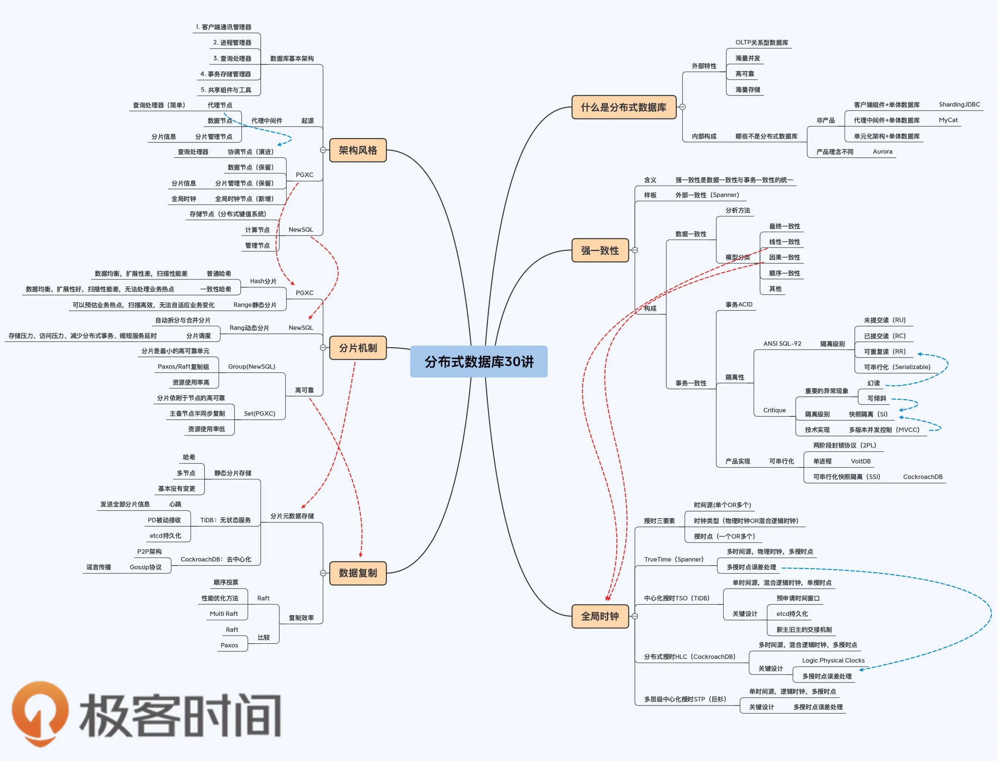

**本节论文参考：**

https://media.amazonwebservices.com/blog/2017/aurora-design-considerations-paper.pdf

#### 第九讲

1. **事务的原子性**就是让包含若干操作的事务表现得像一个最小粒度的操作。这个操作一旦被执行，只有“成功”或者“失败”这两种结果。

   原子性就是要求事务只有两个状态：一是成功，也就是所有操作全部成功；二是失败，任何操作都没有被执行，即使过程中已经执行了部分操作，也要保证回滚这些操作。

2. **TCC 协议**是应用层的分布式事务框架。

3. 相比于 TCC，**2PC** 的优点是借助了数据库的提交和回滚操作，不侵入业务逻辑。但是，它也存在一些**明显的问题**：

   （1）**同步阻塞：**执行过程中，数据库要锁定对应的数据行。如果其他事务刚好也要操作这些数据行，那它们就只能等待。其实同步阻塞只是设计方式，真正的问题在于这种设计会导致分布式事务出现高延迟和性能的显著下降。

   （2）**单点故障：**事务管理器非常重要，一旦发生故障，数据库会一直阻塞下去。尤其是在第二阶段发生故障的话，所有数据库还都处于锁定事务资源的状态中，从而无法继续完成事务操作。

   （3）**数据不一致：**在第二阶段，当事务管理器向参与者发送 Commit 请求之后，发生了局部网络异常，导致只有部分数据库接收到请求，但是其他数据库未接到请求所以无法提交事务，整个系统就会出现数据不一致性的现象。比如，小明的余额已经能够扣减，但是小红的余额没有增加，这样就不符合原子性的要求了。

   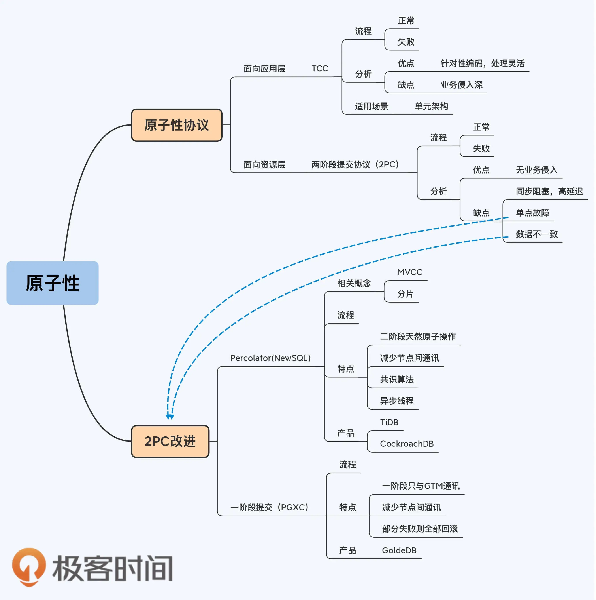

**本节论文参考：**

https://www.cs.princeton.edu/courses/archive/fall10/cos597B/papers/percolator-osdi10.pdf

#### 第十讲

1. **2pc的优化：**

   （1）**缓存写提交**，怎么缩短写操作的延迟呢？第一个办法是将所有写操作缓存起来，直到 commit 语句时一起执行，这种方式称为 Buffering Writes until Commit，我把它翻译为“缓存写提交”。而 TiDB 的事务处理中就采用这种方式，**这种方式有两个缺点**，首先是在客户端发送 Commit 前，SQL 要被缓存起来，如果某个业务场景同时存在长事务和海量并发的特点，那么这个缓存就可能被撑爆或者成为瓶颈。其次是客户端看到的 SQL 交互过程发生了变化，在 MySQL 中如果出现事务竞争，判断优先级的规则是 First Write Win，也就是对同一条记录先执行写操作的事务获胜。而 TiDB 因为缓存了所有写 SQL，所以就变成了 First Commit Win，也就是先提交的事务获胜。

   ​	使用缓存写提交方式优化，可以缩短准备阶段的延迟。但这种方式与事务并发控制技术直接相关，仅在乐观锁时适用，TiDB 使用了这种方式。但是，一旦将并发控制改为悲观协议，事务延迟又会上升。

   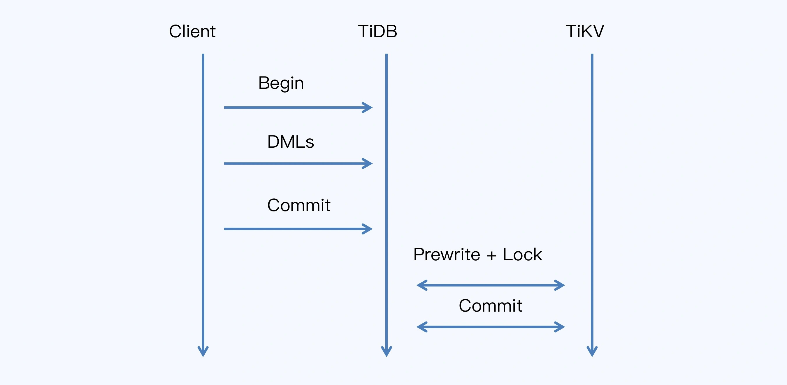

   （2）**管道（Pipeline）**

   ​	有没有一种方法，既能缩短延迟，又能保持交互事务的特点呢？还真有。这就是 CockroachDB 采用的方式，称为 Pipeline。具体过程就是在准备阶段是按照顺序将 SQL 转换为 K/V 操作并执行，但是并不等待返回结果，直接执行下一个 K/V 操作。

   ​	通过管道方式优化，整体事务延迟可以降到两轮共识算法开销，并且在悲观协议下也适用。

   （3）**并行提交（Parallel Commits）**

   ​	并行执行的过程是这样的。准备阶段的操作，在 CockroachDB 中被称为意向写。这个并行执行就是在执行意向写的同时，就写入事务标志，当然这个时候不能确定事务是否提交成功的，所以要引入一个新的状态“Staging”，表示事务正在进行。那么这个记录事务状态的落盘操作和意向写大致是同步发生的，所以只有一轮共识算法开销。

   ​	使用并行提交，可以进一步将整体延迟压缩到一轮共识算法开销。CockroachDB 使用了管道和并行提交这两种优化手段。

   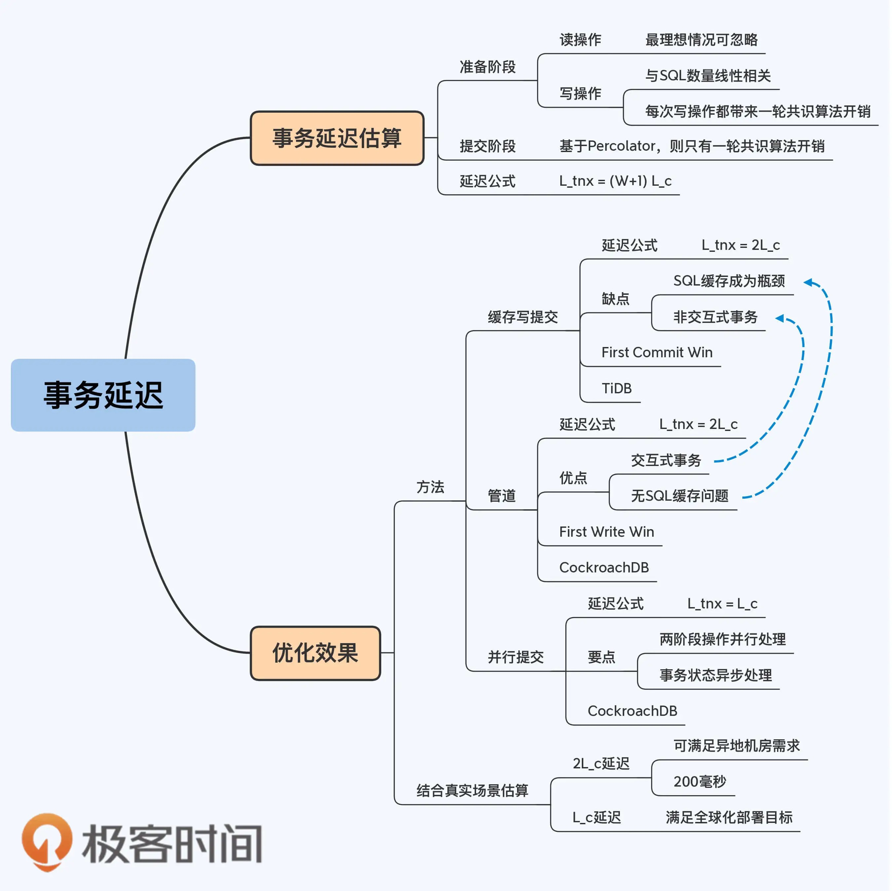

**本节论文参考：**

https://time.geekbang.org/column/article/279660?utm_source=time_web&utm_medium=menu&utm_term=timewebmenu

#### 第十一讲

1. **MVCC的三种存储方式**

   ​	MVCC 有三类存储方式，**一类是将历史版本直接存在数据表中的**，称为 Append-Only，典型代表是 PostgreSQL。**另外两类都是在独立的表空间存储历史版本**，它们区别在于存储的方式是全量还是增量。增量存储就是只存储与版本间变更的部分，这种方式称为 Delta，也就是数学中常作为增量符号的那个 Delta，典型代表是 MySQL 和 Oracle。全量存储则是将每个版本的数据全部存储下来，这种方式称为 Time-Travle，典型代表是 HANA。

   **每种方式的优缺点**：

   （1）**Append-Only 方式：**

   ​		 **优点：**

   ​		在事务包含大量更新操作时也能保持较高效率。因为更新操作被转换为 Delete + Insert，数据并未被迁移，只是有当前版本被标记为历史版本，磁盘操作的开销较小。

   ​		可以追溯更多的历史版本，不必担心回滚段被用完。

   ​		因为执行更新操作时，历史版本仍然留在数据表中，所以如果出现问题，事务能够快速完成回滚操作。

   ​		**缺点：**

   ​		新老数据放在一起，会增加磁盘寻址的开销，随着历史版本增多，会导致查询速度变慢。

   （2）**Delta 方式：**

   ​		**优点：**

   ​		因为历史版本独立存储，所以不会影响当前读的执行效率。

    	   因为存储的只是变化的增量部分，所以占用存储空间较小。

   ​		**缺点：**

   ​		历史版本存储在回滚段中，而回滚段由所有事务共享，并且还是循环使用的。如果一个事务执行持续的时间较长，历史版本可能会被其他数据覆盖，无法查询。

   ​		这个模式下读取的历史版本，实际上是基于当前版本和多个增量版本计算追溯回来的，那么计算开销自然就比较大。

   （3）**Time-Travel 方式：**

   ​		  **优点：**

   ​		  同样是将历史版本独立存储，所以不会影响当前读的执行效率。

   ​		  相对 Delta 方式，历史版本是全量独立存储的，直接访问即可，计算开销小。

   ​		  **缺点：**

   ​		  相对 Delta 方式，需要占用更大的存储空间。

   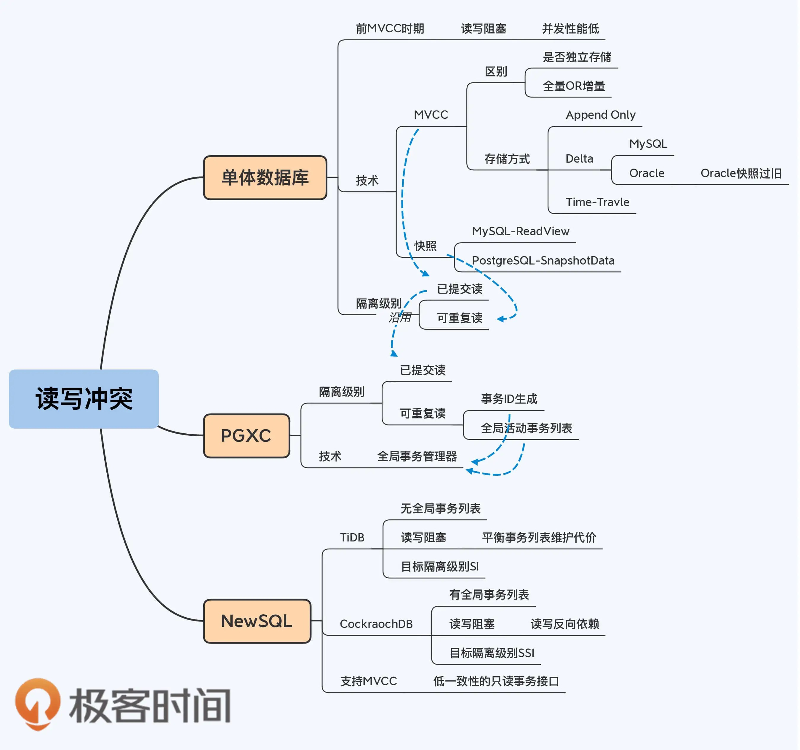

#### 第十二讲

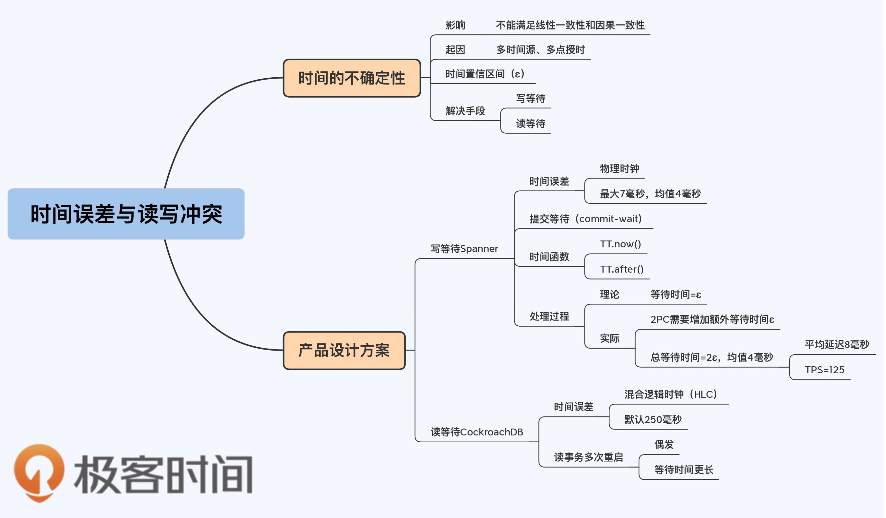

#### 第十三讲

1. 无论是学术界还是工业界，都倾向于将并发控制分为是悲观协议和乐观协议两大类。

   **乐观协议**就是直接提交，遇到冲突就回滚；**悲观协议**就是在真正提交事务前，先尝试对需要修改的资源上锁，只有在确保事务一定能够执行成功后，才开始提交。总之，这个版本的核心就是，**悲观协议是使用锁的**，而乐观协议是不使用锁的。这就非常容易把握了。

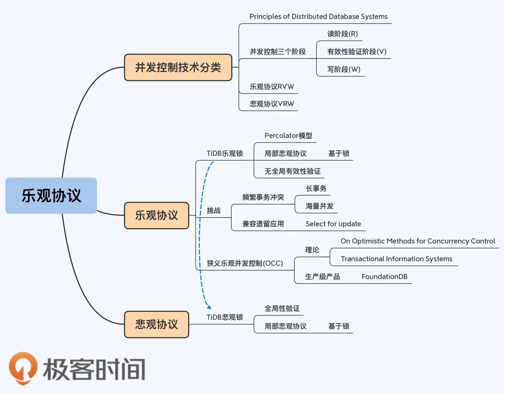

**本节论文参考：**

https://link.springer.com/content/pdf/bfm%3A978-1-4419-8834-8%2F1.pdf

http://www.gbv.de/dms/weimar/toc/647210940_toc.pdf

https://www.cs.du.edu/~leut/4423/papers/kung.pdf

#### 第十四讲

